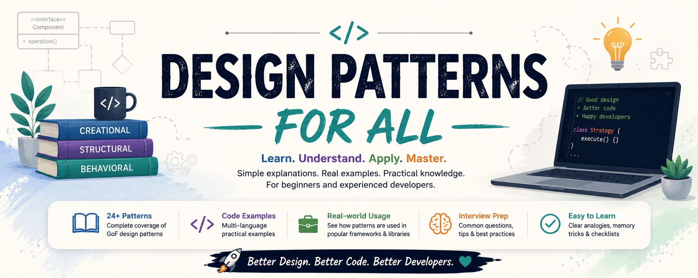

# 🎯 Design Patterns for All
<p align="center"> <I>Open-source gitbook for learning software design patterns</I> </p>

<p align="center">
  
</p>

> ## 📚 Learn • Understand • Apply • Master
>
> A community-driven, beginner-friendly, interview-focused, and production-ready handbook to master **Software Design Patterns** with real-world examples, practical implementations, UML diagrams, and memory tricks.

---

# 🌟 Why this Repository?

Most design pattern resources are either:

- ❌ Too theoretical
- ❌ Too difficult for beginners
- ❌ Filled with complicated UML
- ❌ Lack practical examples
- ❌ Don't explain **when NOT to use** a pattern

This repository aims to solve those problems by providing:

- ✅ Beginner-friendly explanations
- ✅ Real-life analogies
- ✅ Java implementations
- ✅ JavaScript/TypeScript implementations
- ✅ Practical software examples
- ✅ UML diagrams
- ✅ Memory tricks
- ✅ Interview questions
- ✅ Advantages & disadvantages
- ✅ Best practices
- ✅ Common mistakes
- ✅ Pattern comparisons

---

# 🚀 Learning Roadmap

```text
                  START
                    │
                    ▼
            Creational Patterns
                    │
                    ▼
            Structural Patterns
                    │
                    ▼
            Behavioral Patterns
                    │
                    ▼
            Pattern Comparisons
                    │
                    ▼
            Build Mini Projects
                    │
                    ▼
          Master Design Patterns
```

---

# 📚 Pattern Categories at a Glance

| Category | Goal |
|-----------|------|
| 🏗️ Creational | Create objects efficiently |
| 🏛️ Structural | Organize relationships between objects |
| 🤝 Behavioral | Define communication and responsibilities |

---

# 🏗️ Creational Design Patterns

Creational Design Patterns deal with **object creation mechanisms**. They abstract the instantiation process, making a system independent of how its objects are created, composed, and represented. These patterns improve flexibility, reduce code duplication, and promote loose coupling by delegating the responsibility of object creation.

| Pattern | Description |
|----------|-------------|
| 📦 [Simple Factory](./creational/simple-factory.md) | Centralized object creation |
| 🏭 [Factory Method](./creational/factory-method.md) | Delegate object creation to subclasses |
| 🏢 [Abstract Factory](./creational/abstract-factory.md) | Create families of related objects |
| 👷 [Builder](./creational/builder.md) | Step-by-step object construction |
| 🐑 [Prototype](./creational/prototype.md) | Clone existing objects |
| 💎 [Singleton](./creational/singleton.md) | Ensure only one instance exists |

---

# 🏛️ Structural Design Patterns

Structural Design Patterns deal with **the composition of classes and objects**. They help build larger and more maintainable systems by defining efficient ways to combine objects and classes while keeping the design simple, flexible, and easy to extend without modifying existing code.

| Pattern | Description |
|----------|-------------|
| 🔌 [Adapter](./structural/adapter.md) | Makes incompatible interfaces work together |
| 🌉 [Bridge](./structural/bridge.md) | Separates abstraction from implementation |
| 🌳 [Composite](./structural/composite.md) | Treat groups and objects uniformly |
| 🎁 [Decorator](./structural/decorator.md) | Add functionality dynamically |
| 🏠 [Facade](./structural/facade.md) | Simplifies a complex subsystem |
| 🍃 [Flyweight](./structural/flyweight.md) | Reuse shared objects to save memory |
| 🛡️ [Proxy](./structural/proxy.md) | Control access to another object |

---

# 🤝 Behavioral Design Patterns

Behavioral Design Patterns deal with **communication and interaction between objects**. They define how objects collaborate, share responsibilities, and exchange information to achieve complex behavior while maintaining loose coupling and improving the overall maintainability of the system.

| Pattern | Description |
|----------|-------------|
| 🔗 [Chain of Responsibility](./behavioral/chain-of-responsibility.md) | Pass request through handlers |
| 🎮 [Command](./behavioral/command.md) | Encapsulate actions as objects |
| ➰ [Iterator](./behavioral/iterator.md) | Sequential collection traversal |
| 👥 [Mediator](./behavioral/mediator.md) | Central communication hub |
| 💾 [Memento](./behavioral/memento.md) | Save and restore object state |
| 📢 [Observer](./behavioral/observer.md) | Publish–subscribe mechanism |
| 👨‍💼 [Visitor](./behavioral/visitor.md) | Add new operations externally |
| 💡 [Strategy](./behavioral/strategy.md) | Switch algorithms dynamically |
| 🔄 [State](./behavioral/state.md) | Change behavior based on state |
| 📒 [Template Method](./behavioral/template-method.md) | Define algorithm skeleton |

---
# 📚 Docs

- [What is GoF (Gang of Four) Design Patterns?](assets/docs/What_is_GoF_Design_Patterns.md)

---
# 🎓 Recommended Learning Order

```text
Simple Factory
      │
      ▼
Factory Method
      │
      ▼
Abstract Factory
      │
      ▼
   Builder
      │
      ▼
  Prototype
      │
      ▼
  Singleton
      │
      ▼
   Adapter
      │
      ▼
  Decorator
      │
      ▼
   Facade
      │
      ▼
    Proxy
      │
      ▼
  Composite
      │
      ▼
   Bridge
      │
      ▼
  Flyweight
      │
      ▼
  Strategy
      │
      ▼
  Observer
      │
      ▼
   Command
      │
      ▼
    State
      │
      ▼
Template Method
      │
      ▼
   Mediator
      │
      ▼
Chain of Responsibility
      │
      ▼
   Iterator
      │
      ▼
   Memento
      │
      ▼
   Visitor
```

---

# 🧠 What Every Pattern Page Includes

Every markdown file in this repository follows the same structure.

- 📌 Definition
- 🎯 Intent
- ❓ Problem It Solves
- 💭 Core Concept
- 🌍 Real-Life Analogy
- 🏢 Real Software Example
- 📊 UML Diagram
- ☕ Java Example
- 🟨 JavaScript Example
- ⚡ Advantages
- ⚠️ Disadvantages
- ✅ When to Use
- ❌ When Not to Use
- 💼 Production Use Cases
- 🎤 Interview Questions
- 🧠 Memory Trick
- 📋 Implementation Checklist
- 🔄 Comparison with Similar Patterns

---

# 🏆 Perfect For

- 👨‍🎓 Students
- 👨‍💻 Software Engineers
- 🚀 Full Stack Developers
- ☕ Java Developers
- 🌐 JavaScript Developers
- 🏢 System Designers
- 🎯 Interview Preparation
- 📖 Self Learning
- 👥 Open Source Contributors

---

# 📖 Repository Structure

```text
design-patterns-for-all/
│
├── README.md
│
├── creational/
│   ├── simple-factory.md
│   ├── factory-method.md
│   ├── abstract-factory.md
│   ├── builder.md
│   ├── prototype.md
│   └── singleton.md
│
├── structural/
│   ├── adapter.md
│   ├── bridge.md
│   ├── composite.md
│   ├── decorator.md
│   ├── facade.md
│   ├── flyweight.md
│   └── proxy.md
│
├── behavioral/
│   ├── chain-of-responsibility.md
│   ├── command.md
│   ├── iterator.md
│   ├── mediator.md
│   ├── memento.md
│   ├── observer.md
│   ├── visitor.md
│   ├── strategy.md
│   ├── state.md
│   └── template-method.md
│
└── assets/
    ├── docs/
    └── images/
    
```
---

# 🤝 Contributing

Contributions are always welcome.

You can contribute by:

- Improving explanations
- Adding diagrams
- Adding C# examples
- Adding Go examples
- Fixing typos
- Improving UML diagrams
- Adding interview questions
- Adding production use cases

Please create an issue before submitting large changes.

---

# 💡 Future Roadmap

- [ ] Mermaid UML diagrams
- [ ] Python implementations
- [ ] C# implementations
- [ ] Go implementations
- [ ] Interactive examples
- [ ] Mini projects
- [ ] Pattern comparison pages
- [ ] Architecture patterns
- [ ] SOLID principles handbook
- [ ] Low-Level Design interview guide

---

# ⭐ Support the Project

<p align="center">


</p>

If this repository helped you learn something new,

please consider:

- ⭐ Starring the repository
- 🍴 Forking it
- 🗣️ Sharing it with friends
- 🤝 Contributing improvements

Every contribution helps developers around the world.

---

# 📜 License

This project is open source and available under the **MIT License**.

---

<p align="center">

## 🚀 Better Design. Better Code. Better Developers.

Made with ❤️ for the developer community.

</p>
