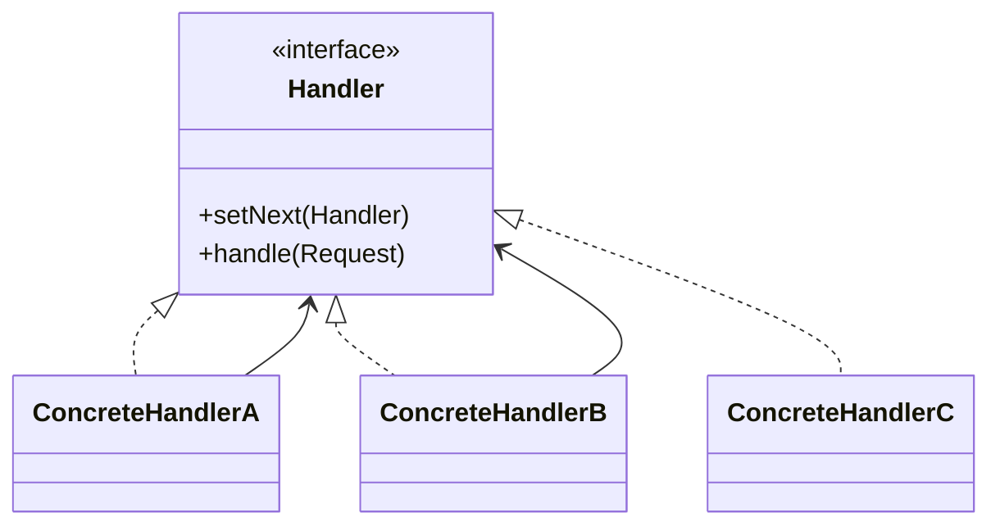

# Chain Of Responsibility

## Definition

The **Chain of Responsibility Pattern** is a **behavioral design pattern** that allows a request to pass through a **chain of handlers**, where each handler decides whether to process the request or pass it to the next handler.

It decouples the sender of a request from its receivers by giving multiple objects a chance to handle the request.

---

## Problem It Solves

Suppose an approval system has multiple approval levels:

- Team Lead
- Manager
- Director

Without Chain of Responsibility:

```java
if (amount <= 1000) {
    teamLead.approve();
} else if (amount <= 10000) {
    manager.approve();
} else {
    director.approve();
}
```

Problems:

- Tight coupling between sender and receivers.
- Large conditional statements.
- Difficult to add or reorder handlers.

The Chain of Responsibility lets each handler decide whether to process or forward the request.

---

## Core Idea

1. Define a common `Handler` interface.
2. Each handler stores a reference to the next handler.
3. A request is sent to the first handler.
4. If the current handler cannot process it, it forwards the request.
5. The chain continues until a handler processes it or the chain ends.

---

## Real-Life Analogy

Imagine calling **customer support**.

```text
  Customer
     │
     ▼
Level 1 Support
     │
     ▼
Level 2 Support
     │
     ▼
Senior Engineer
```

If Level 1 cannot solve the issue, it forwards it to Level 2.

If Level 2 cannot solve it, it forwards it to the Senior Engineer.

The customer doesn't need to know who ultimately handles the request.

---

## UML Structure



Flow:

```text
Request
   │
   ▼
Handler A
   │
Can Handle?
 │      │
Yes     No
 │       │
 ▼       ▼
Done  Handler B
            │
       Can Handle?
        │      │
      Yes      No
        │       │
        ▼       ▼
      Done   Handler C
```

---

## Java Example

```java
abstract class Approver {

    protected Approver next;

    public void setNext(Approver next) {
        this.next = next;
    }

    public abstract void approve(int amount);
}

class TeamLead extends Approver {

    @Override
    public void approve(int amount) {

        if (amount <= 1000) {
            System.out.println("Approved by Team Lead");
        } else if (next != null) {
            next.approve(amount);
        }
    }
}

class Manager extends Approver {

    @Override
    public void approve(int amount) {

        if (amount <= 10000) {
            System.out.println("Approved by Manager");
        } else if (next != null) {
            next.approve(amount);
        }
    }
}

class Director extends Approver {

    @Override
    public void approve(int amount) {
        System.out.println("Approved by Director");
    }
}

public class Main {

    public static void main(String[] args) {

        TeamLead teamLead = new TeamLead();
        Manager manager = new Manager();
        Director director = new Director();

        teamLead.setNext(manager);
        manager.setNext(director);

        teamLead.approve(500);
        teamLead.approve(5000);
        teamLead.approve(50000);
    }
}
```

---

## JavaScript / TypeScript Example

```ts
abstract class Approver {
  protected next?: Approver;

  setNext(next: Approver): Approver {
    this.next = next;
    return next;
  }

  abstract approve(amount: number): void;
}

class TeamLead extends Approver {
  approve(amount: number): void {
    if (amount <= 1000) {
      console.log("Approved by Team Lead");
    } else {
      this.next?.approve(amount);
    }
  }
}

class Manager extends Approver {
  approve(amount: number): void {
    if (amount <= 10000) {
      console.log("Approved by Manager");
    } else {
      this.next?.approve(amount);
    }
  }
}

class Director extends Approver {
  approve(amount: number): void {
    console.log("Approved by Director");
  }
}

const teamLead = new TeamLead();
const manager = new Manager();
const director = new Director();

teamLead.setNext(manager).setNext(director);

teamLead.approve(500);
teamLead.approve(5000);
teamLead.approve(50000);
```

---

## Real Software Example

Chain of Responsibility is commonly used in:

- HTTP middleware pipelines
- Authentication and authorization chains
- Logging frameworks
- Event handling systems
- Exception processing
- Servlet filters

Examples:

```text
 HTTP Request
      │
      ▼
Authentication Middleware
      │
      ▼
Authorization Middleware
      │
      ▼
Validation Middleware
      │
      ▼
 Controller
```

Another example:

```text
 Mouse Click
      │
      ▼
   Button
      │
      ▼
    Panel
      │
      ▼
   Window
```

Each component gets a chance to handle the event.

---

## Advantages

- Reduces coupling between sender and receiver.
- Supports dynamic handler chains.
- Simplifies adding or removing handlers.
- Eliminates large `if-else` or `switch` blocks.
- Follows the Open/Closed Principle.
- Improves flexibility.

---

## Disadvantages

- Requests may go unhandled if no handler processes them.
- Debugging long chains can be difficult.
- Performance may suffer with many handlers.
- Chain order must be configured carefully.

---

## When to Use

Use Chain of Responsibility when:

- Multiple objects can handle a request.
- The handler should be chosen dynamically.
- Processing order matters.
- You want to avoid hardcoded conditional logic.

Examples:

- Middleware
- Approval workflows
- Event bubbling
- Logging systems
- Request processing pipelines

---

## When Not to Use

Avoid Chain of Responsibility when:

- Only one handler will ever exist.
- Routing logic is simple and fixed.
- Chain traversal introduces unnecessary overhead.
- Direct invocation is clearer and simpler.

---

## Interview Questions

### 1. What is the Chain of Responsibility Pattern?

It is a behavioral pattern that passes a request through a chain of handlers until one of them processes it.

---

### 2. What problem does it solve?

It decouples request senders from receivers and eliminates large conditional statements for selecting handlers.

---

### 3. What are the main participants?

- **Handler**
- **Concrete Handlers**
- **Client**
- **Request**

Each handler optionally forwards the request to the next handler.

---

### 4. How is Chain of Responsibility different from Command?

**Chain of Responsibility**

- Multiple handlers may inspect a request.
- The request moves through a chain.

**Command**

- Encapsulates a request as an object.
- Usually has one receiver.

---

### 5. How is Chain of Responsibility different from Mediator?

**Chain of Responsibility**

- Passes requests sequentially.

**Mediator**

- Centralizes communication among multiple objects.

---

### 6. What happens if no handler processes the request?

The request reaches the end of the chain and may remain unhandled unless a default handler exists.

---

### 7. What are common real-world examples?

- Express.js middleware
- Spring Security filters
- Servlet filters
- Approval workflows
- Customer support escalation
- Event bubbling in UI frameworks

---

## Memory Trick

> **"If I can't handle it, I'll pass it along."**

Think of a **customer support escalation chain**:

```text
 Customer
    │
    ▼
  Agent
    │
    ▼
Supervisor
    │
    ▼
 Manager
```

Each person either solves the issue or forwards it to the next level.

---

## Implementation Checklist

- ✅ Define a common `Handler` interface or abstract class.
- ✅ Store a reference to the next handler.
- ✅ Allow handlers to process or forward requests.
- ✅ Configure the chain in the desired order.
- ✅ Ensure clients send requests only to the first handler.
- ✅ Provide a fallback or default handler if appropriate.
- ✅ Keep handlers focused on a single responsibility.
