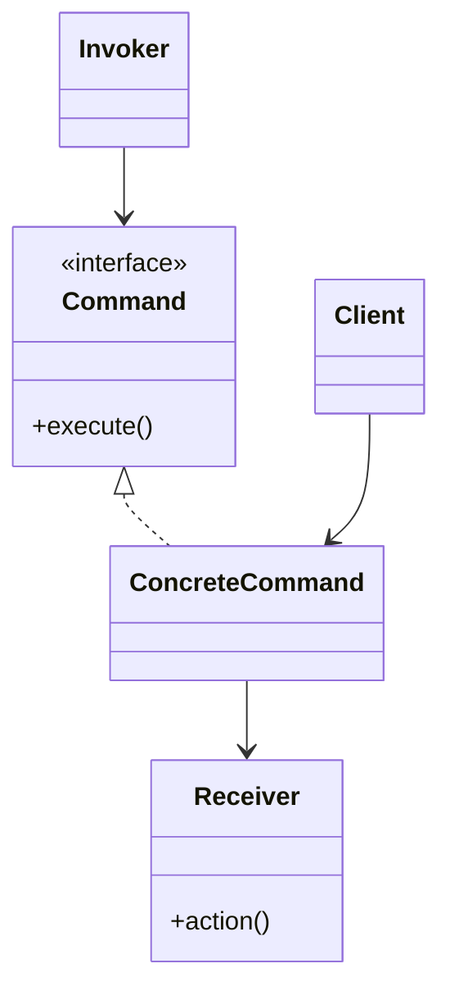

# Command

## Definition

The **Command Pattern** is a **behavioral design pattern** that **encapsulates a request as an object**, allowing requests to be parameterized, queued, logged, stored, and undone independently of the object that executes them.

Instead of directly calling a method on a receiver, the client creates a command object that represents the action to be performed.

The primary goal is to **decouple the sender of a request from the receiver that executes it**.

---

## Problem It Solves

Suppose you are building a remote control.

Without Command:

```java
button.onClick() {
    light.turnOn();
}
```

Problems:

- UI is tightly coupled to business logic.
- Difficult to support undo/redo.
- Hard to queue or log actions.
- Adding new actions requires changing existing code.

The Command pattern converts actions into objects that can be managed independently.

---

## Core Idea

1. Define a common `Command` interface.
2. Create concrete command classes.
3. Each command stores a receiver object.
4. The command delegates execution to the receiver.
5. The invoker triggers commands without knowing implementation details.

The invoker only knows:

```java
command.execute();
```

---

## Real-Life Analogy

Think of ordering food at a restaurant.

```text
 Customer
    │
    ▼
  Waiter
    │
    ▼
 Kitchen
```

- Customer = Client
- Waiter = Command
- Chef/Kitchen = Receiver

The waiter carries the order without knowing how the food is prepared.

The kitchen executes the request.

---

## UML Structure



Flow:

```text
Client
   │
   ▼
Command Object
   │
   ▼
Invoker
   │
 execute()
   │
   ▼
Receiver
```

---

## Java Example

```java
interface Command {

    void execute();
}

class Light {

    public void turnOn() {
        System.out.println("Light ON");
    }

    public void turnOff() {
        System.out.println("Light OFF");
    }
}

class LightOnCommand implements Command {

    private Light light;

    public LightOnCommand(Light light) {
        this.light = light;
    }

    @Override
    public void execute() {
        light.turnOn();
    }
}

class RemoteControl {

    private Command command;

    public void setCommand(Command command) {
        this.command = command;
    }

    public void pressButton() {
        command.execute();
    }
}

public class Main {

    public static void main(String[] args) {

        Light light = new Light();

        Command command = new LightOnCommand(light);

        RemoteControl remote = new RemoteControl();

        remote.setCommand(command);

        remote.pressButton();
    }
}
```

---

## JavaScript / TypeScript Example

```ts
interface Command {
  execute(): void;
}

class Light {
  turnOn(): void {
    console.log("Light ON");
  }
}

class LightOnCommand implements Command {
  constructor(private light: Light) {}

  execute(): void {
    this.light.turnOn();
  }
}

class RemoteControl {
  private command!: Command;

  setCommand(command: Command): void {
    this.command = command;
  }

  pressButton(): void {
    this.command.execute();
  }
}

const light = new Light();

const command = new LightOnCommand(light);

const remote = new RemoteControl();

remote.setCommand(command);

remote.pressButton();
```

---

## Real Software Example

Command is commonly used in:

- Undo/Redo systems
- GUI buttons and menu actions
- Task queues
- Job schedulers
- Macro recording
- Transaction processing

Examples:

```text
Button Click
      │
      ▼
SaveCommand
      │
      ▼
Document Service
```

Another example:

```text
Undo Stack

Command 1
Command 2
Command 3
```

Each command can be replayed or reversed independently.

---

## Advantages

- Decouples sender from receiver.
- Supports undo and redo operations.
- Enables request queuing.
- Allows command logging and auditing.
- Supports macro commands.
- Follows the Open/Closed Principle.

---

## Disadvantages

- Introduces additional classes.
- Can increase system complexity.
- Small applications may become over-engineered.
- Many commands may lead to class proliferation.

---

## When to Use

Use Command when:

- Requests should be represented as objects.
- Undo/redo functionality is required.
- Actions need to be queued or scheduled.
- Requests should be logged.
- Senders should remain independent from receivers.

Examples:

- Text editors
- GUI applications
- Workflow systems
- Job queues
- Task schedulers

---

## When Not to Use

Avoid Command when:

- Requests are simple and unlikely to change.
- Undo/redo is unnecessary.
- Direct method invocation is sufficient.
- Additional abstraction adds little value.

---

## Interview Questions

### 1. What is the Command Pattern?

It is a behavioral pattern that encapsulates a request as an object, allowing execution, queuing, logging, and undo functionality.

---

### 2. What problem does Command solve?

It decouples request senders from receivers and turns actions into reusable objects.

---

### 3. What are the main participants?

- **Command**
- **Concrete Command**
- **Receiver**
- **Invoker**
- **Client**

---

### 4. How is Command different from Strategy?

**Command**

- Encapsulates an action or request.
- Often supports undo, queues, and logging.

**Strategy**

- Encapsulates an algorithm.
- Focuses on interchangeable behaviors.

---

### 5. How does Command support undo?

Commands can store previous state and provide an additional method:

```java
undo();
```

allowing actions to be reversed.

---

### 6. What is a Macro Command?

A command that contains multiple commands and executes them together.

Example:

```text
Morning Routine
 ├── Open Curtains
 ├── Start Coffee Machine
 └── Turn On Lights
```

---

### 7. What are common real-world examples?

- IDE undo/redo
- Toolbar buttons
- Menu actions
- Job schedulers
- Queue systems
- Remote controls

---

## Memory Trick

> **"Turn the action into an object."**

Think of a restaurant:

```text
 Customer
    │
    ▼
Order Slip
    │
    ▼
 Kitchen
```

The order slip contains the request.

It can be:

- Stored
- Logged
- Queued
- Replayed

The order slip is the **Command**.

---

## Implementation Checklist

- ✅ Define a common `Command` interface.
- ✅ Create concrete command classes.
- ✅ Store a receiver inside each command.
- ✅ Delegate execution to the receiver.
- ✅ Create an invoker that triggers commands.
- ✅ Keep clients independent of receivers.
- ✅ Add undo/redo support when required.
- ✅ Consider command history for logging and replay functionality.
