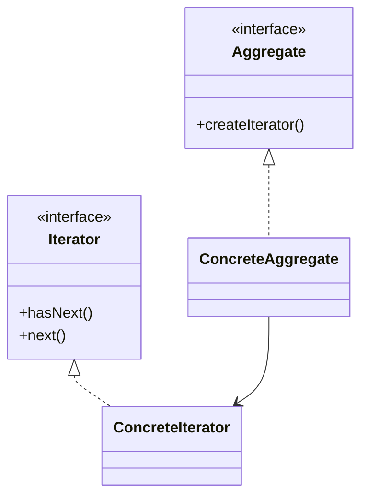

# Iterator

## Definition

The **Iterator Pattern** is a **behavioral design pattern** that provides a way to **access elements of a collection sequentially without exposing its underlying representation**.

It separates the traversal logic from the collection itself, allowing clients to iterate through different data structures using a common interface.

The primary goal is to **provide a standard way to traverse collections while hiding implementation details**.

---

## Problem It Solves

Suppose you have multiple collections:

- Array
- Linked List
- Tree
- Hash Table

Without Iterator:

```java
for(int i = 0; i < array.length; i++) {}

Node current = head;
while(current != null) {}

traverseTree(root);
```

Problems:

- Different traversal logic for every collection.
- Client code depends on collection internals.
- Difficult to switch collection implementations.

The Iterator pattern provides a unified traversal interface.

---

## Core Idea

1. Define an `Iterator` interface.
2. Create concrete iterators for collections.
3. The iterator maintains traversal state.
4. Clients use iterator methods instead of collection internals.

Typical operations:

```java
hasNext()
next()
```

The collection provides the iterator.

---

## Real-Life Analogy

Think of a **TV remote's channel buttons**.

```text
 TV Channels
     │
     ▼
Remote Control
     │
     ▼
 Next Channel
```

The user does not need to know:

- How channels are stored.
- Whether they are in an array or database.

The remote simply provides a way to move through them.

---

## UML Structure



Flow:

```text
Collection
    │
createIterator()
    │
    ▼
 Iterator
    │
 ┌──┴─────┐
 ▼        ▼
next()  hasNext()
```

---

## Java Example

```java
import java.util.ArrayList;
import java.util.List;

class NameIterator {

    private List<String> names;
    private int position = 0;

    public NameIterator(List<String> names) {
        this.names = names;
    }

    public boolean hasNext() {
        return position < names.size();
    }

    public String next() {
        return names.get(position++);
    }
}

public class Main {

    public static void main(String[] args) {

        List<String> names = new ArrayList<>();

        names.add("Alice");
        names.add("Bob");
        names.add("Charlie");

        NameIterator iterator =
                new NameIterator(names);

        while (iterator.hasNext()) {
            System.out.println(iterator.next());
        }
    }
}
```

---

## JavaScript / TypeScript Example

```ts
class NameIterator {
  private position = 0;

  constructor(private names: string[]) {}

  hasNext(): boolean {
    return this.position < this.names.length;
  }

  next(): string {
    return this.names[this.position++];
  }
}

const iterator = new NameIterator([
  "Alice",
  "Bob",
  "Charlie",
]);

while (iterator.hasNext()) {
  console.log(iterator.next());
}
```

Modern TypeScript also supports built-in iterators:

```ts
for (const name of ["Alice", "Bob", "Charlie"]) {
  console.log(name);
}
```

---

## Real Software Example

Iterator is commonly used in:

- Java Collections Framework
- C++ STL Iterators
- JavaScript Iterables
- Database cursors
- File readers
- Tree traversal APIs

Examples:

```java
Iterator<String> iterator =
        list.iterator();

while(iterator.hasNext()) {
    System.out.println(iterator.next());
}
```

Another example:

```text
Browser History
      │
      ▼
History Iterator

Back
Forward
Current
```

Traversal is separated from storage.

---

## Advantages

- Hides collection implementation details.
- Provides a uniform traversal interface.
- Supports multiple traversal strategies.
- Simplifies collection classes.
- Encourages Single Responsibility Principle.
- Allows parallel iterators on the same collection.

---

## Disadvantages

- Adds extra classes and interfaces.
- May be unnecessary for simple collections.
- Traversal can become less efficient in some cases.
- More abstraction means slightly higher complexity.

---

## When to Use

Use Iterator when:

- Collection internals should remain hidden.
- Multiple traversal methods are needed.
- Different collection types should share a common traversal interface.
- You want to separate traversal logic from collection logic.

Examples:

- Collections
- Trees
- Graphs
- Database result sets
- File systems

---

## When Not to Use

Avoid Iterator when:

- Collections are very simple.
- Direct access is sufficient.
- Traversal logic is trivial.
- Additional abstraction provides little benefit.

---

## Interview Questions

### 1. What is the Iterator Pattern?

It is a behavioral pattern that provides sequential access to collection elements without exposing the collection's internal structure.

---

### 2. What problem does Iterator solve?

It separates traversal logic from collection implementation and provides a standard way to iterate over data.

---

### 3. What are the main participants?

- **Iterator**
- **Concrete Iterator**
- **Aggregate**
- **Concrete Aggregate**
- **Client**

---

### 4. What are common iterator operations?

```java
hasNext()
next()
```

Sometimes:

```java
remove()
current()
reset()
```

---

### 5. How is Iterator different from Composite?

**Iterator**

- Traverses objects.

**Composite**

- Organizes objects into hierarchies.

Iterator is often used to traverse Composite structures.

---

### 6. Can multiple iterators traverse the same collection?

Yes.

Each iterator maintains its own traversal state independently.

---

### 7. What are common real-world examples?

- Java Iterator
- Java Streams
- JavaScript Iterables
- Database cursors
- Browser history navigation
- File system traversal

---

## Memory Trick

> **"Walk through a collection without knowing how it's stored."**

Think of a **TV remote**:

```text
TV Channels
     │
     ▼
  Remote
     │
     ▼
Next Channel
```

You can browse channels without knowing where or how they are stored internally.

The remote is the **Iterator**.

---

## Implementation Checklist

- ✅ Define an `Iterator` interface.
- ✅ Include methods like `hasNext()` and `next()`.
- ✅ Create concrete iterator implementations.
- ✅ Store traversal state inside the iterator.
- ✅ Keep collection internals hidden.
- ✅ Let collections create and return iterators.
- ✅ Support multiple iterators if required.
- ✅ Separate traversal logic from collection logic.
