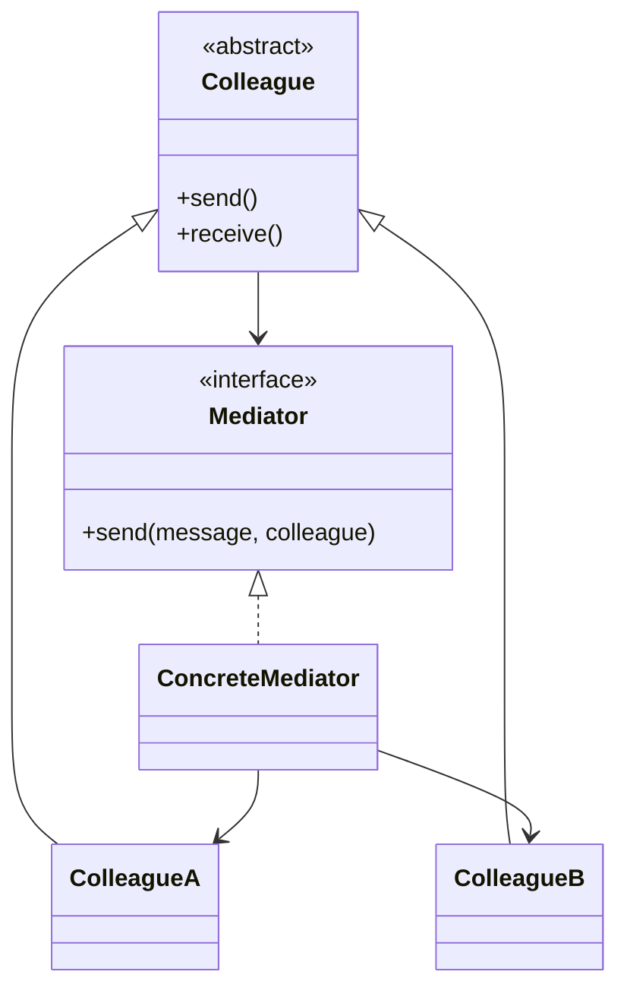

# Mediator

## Definition

The **Mediator Pattern** is a **behavioral design pattern** that **centralizes communication between multiple objects** by introducing a mediator object.

Instead of objects communicating directly with each other, they communicate through the mediator, which coordinates interactions and manages dependencies.

The primary goal is to **reduce coupling between objects and simplify communication logic**.

---

## Problem It Solves

Suppose a chat application contains:

- User A
- User B
- User C
- User D

Without a Mediator:

```text
A ↔ B
A ↔ C
A ↔ D
B ↔ C
B ↔ D
C ↔ D
```

Every object must know about every other object.

Problems:

- Tight coupling
- Complex dependencies
- Difficult maintenance
- Hard to add new participants

The Mediator centralizes communication.

---

## Core Idea

1. Create a `Mediator` interface.
2. Objects (Colleagues) communicate only with the mediator.
3. The mediator coordinates interactions.
4. Objects no longer reference each other directly.

Instead of:

```text
Object ↔ Object
```

Communication becomes:

```text
Object → Mediator → Object
```

---

## Real-Life Analogy

Think of an **air traffic control tower**.

Without a tower:

```text
Plane A ↔ Plane B
Plane A ↔ Plane C
Plane B ↔ Plane C
...
```

This becomes chaotic.

With a control tower:

```text
 Plane A
    │
    ▼
Control Tower
    ▲
    │
Plane B
Plane C
Plane D
```

All communication flows through the tower.

The tower is the **Mediator**.

---

## UML Structure



Flow:

```text
Colleague A
     │
     ▼
  Mediator
     │
     ▼
Colleague B
```

---

## Java Example

```java
interface ChatMediator {

    void sendMessage(String message, User sender);
}

class ChatRoom implements ChatMediator {

    @Override
    public void sendMessage(
            String message,
            User sender
    ) {
        System.out.println(
            sender.getName() + ": " + message
        );
    }
}

abstract class User {

    protected ChatMediator mediator;
    protected String name;

    public User(ChatMediator mediator, String name) {
        this.mediator = mediator;
        this.name = name;
    }

    public String getName() {
        return name;
    }

    public abstract void send(String message);
}

class ChatUser extends User {

    public ChatUser(
            ChatMediator mediator,
            String name
    ) {
        super(mediator, name);
    }

    @Override
    public void send(String message) {
        mediator.sendMessage(message, this);
    }
}

public class Main {

    public static void main(String[] args) {

        ChatMediator chatRoom = new ChatRoom();

        User alice =
                new ChatUser(chatRoom, "Alice");

        User bob =
                new ChatUser(chatRoom, "Bob");

        alice.send("Hello Bob!");
        bob.send("Hi Alice!");
    }
}
```

---

## JavaScript / TypeScript Example

```ts
interface Mediator {
  sendMessage(
    message: string,
    sender: User
  ): void;
}

class ChatRoom implements Mediator {
  sendMessage(
    message: string,
    sender: User
  ): void {
    console.log(`${sender.name}: ${message}`);
  }
}

abstract class User {
  constructor(
    protected mediator: Mediator,
    public name: string
  ) {}

  abstract send(message: string): void;
}

class ChatUser extends User {
  send(message: string): void {
    this.mediator.sendMessage(
      message,
      this
    );
  }
}

const chatRoom = new ChatRoom();

const alice =
  new ChatUser(chatRoom, "Alice");

const bob =
  new ChatUser(chatRoom, "Bob");

alice.send("Hello Bob!");
bob.send("Hi Alice!");
```

---

## Real Software Example

Mediator is commonly used in:

- Chat applications
- Air traffic control systems
- GUI frameworks
- Event buses
- Message brokers
- Workflow engines

Examples:

```text
 Button
Textbox
Dropdown
Checkbox
    │
    ▼
Dialog Mediator
```

Instead of each component talking to every other component, they communicate through the dialog.

Another example:

```text
Microservice A
Microservice B
Microservice C
       │
       ▼
 Message Broker
(Kafka/RabbitMQ)
```

The broker acts as a mediator.

---

## Advantages

- Reduces coupling between objects.
- Centralizes communication logic.
- Simplifies object relationships.
- Improves maintainability.
- Makes systems easier to extend.
- Encourages Single Responsibility Principle.

---

## Disadvantages

- Mediator can become overly complex.
- May evolve into a "God Object".
- Centralized logic can become difficult to maintain.
- Adds an additional abstraction layer.

---

## When to Use

Use Mediator when:

- Many objects communicate with each other.
- Dependencies become difficult to manage.
- Communication logic should be centralized.
- Reusable object components are desired.

Examples:

- Chat rooms
- UI dialogs
- Event systems
- Workflow engines
- Message brokers

---

## When Not to Use

Avoid Mediator when:

- Only a few objects interact.
- Direct communication is simpler.
- Centralization introduces unnecessary complexity.
- The mediator would become excessively large.

---

## Interview Questions

### 1. What is the Mediator Pattern?

It is a behavioral pattern that centralizes communication between objects through a mediator object.

---

### 2. What problem does Mediator solve?

It reduces direct dependencies among objects and simplifies communication management.

---

### 3. What are the main participants?

- **Mediator**
- **Concrete Mediator**
- **Colleague**
- **Concrete Colleague**

---

### 4. How is Mediator different from Observer?

**Mediator**

- Centralizes two-way communication.
- Controls interactions among participants.

**Observer**

- Supports one-to-many notifications.
- Observers react independently.

---

### 5. How is Mediator different from Facade?

**Mediator**

- Coordinates communication between peer objects.

**Facade**

- Simplifies access to a subsystem.

Mediator manages behavior; Facade simplifies interfaces.

---

### 6. What is the biggest risk of using Mediator?

The mediator may become a **God Object** containing excessive coordination logic.

---

### 7. What are common real-world examples?

- Chat rooms
- Air traffic control towers
- GUI dialog controllers
- Message brokers
- Workflow orchestration systems
- Event buses

---

## Memory Trick

> **"Everyone talks to the mediator, not to each other."**

Think of an **air traffic control tower**:

```text
Plane A
Plane B
Plane C
    │
    ▼
Control Tower
```

Planes never communicate directly.

The control tower coordinates all communication.

The tower is the **Mediator**.

---

## Implementation Checklist

- ✅ Identify objects with excessive direct communication.
- ✅ Create a `Mediator` interface.
- ✅ Implement a concrete mediator.
- ✅ Make colleagues communicate only through the mediator.
- ✅ Remove direct references between colleagues where possible.
- ✅ Centralize coordination logic inside the mediator.
- ✅ Keep the mediator focused and avoid turning it into a God Object.
- ✅ Use Mediator when communication complexity becomes difficult to manage.
