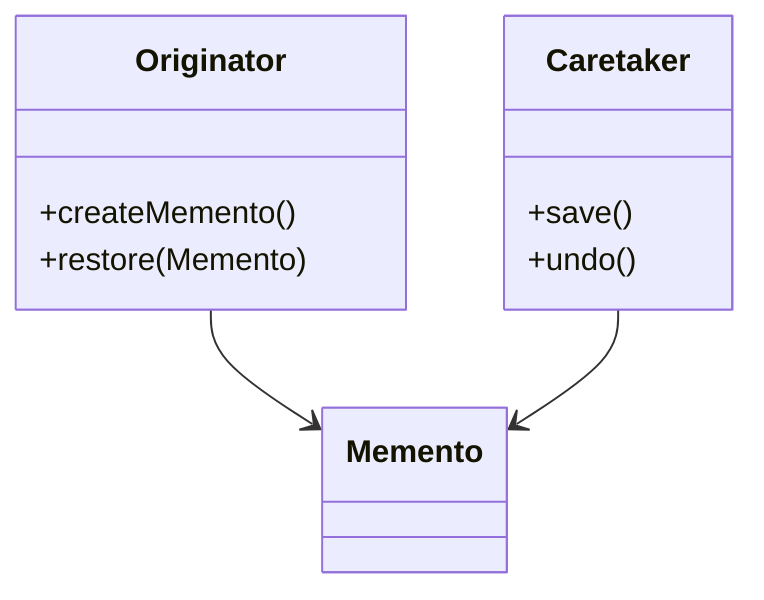

# Memento

## Definition

The **Memento Pattern** is a **behavioral design pattern** that allows an object to **save and restore its previous state without exposing its internal implementation details**.

It captures an object's state inside a separate **Memento** object so that the object can later be restored to that state.

The primary goal is to provide **undo, rollback, and state restoration functionality while preserving encapsulation**.

---

## Problem It Solves

Suppose you're building a text editor.

A user can:

- Type text
- Delete text
- Format text
- Undo changes

Without Memento:

```java
editor.undo();
```

The editor would need to expose its internal fields or maintain complex state management logic.

Problems:

- Breaks encapsulation.
- Makes undo functionality difficult.
- Complicates rollback operations.

The Memento pattern stores snapshots of an object's state safely.

---

## Core Idea

1. The **Originator** creates snapshots of its state.
2. The snapshot is stored inside a **Memento** object.
3. A **Caretaker** manages saved mementos.
4. The Originator can restore itself from a saved memento.

Flow:

```text
 Save State
     │
     ▼
  Memento
     │
     ▼
Restore Later
```

The Caretaker never modifies the stored state.

---

## Real-Life Analogy

Think of a **video game save file**.

```text
Game
 │
 ▼
Save File
 │
 ▼
Load Later
```

When the player saves:

- Character position
- Health
- Inventory
- Progress

are stored.

Later, the player can restore the game to that exact state.

The save file is the **Memento**.

---

## UML Structure



Flow:

```text
 Originator
     │
createMemento()
     │
     ▼
  Memento
     │
     ▼
 Caretaker

  Later...

 Caretaker
     │
     ▼
 restore()
     │
     ▼
 Originator
```

---

## Java Example

```java
class EditorMemento {

    private final String content;

    public EditorMemento(String content) {
        this.content = content;
    }

    public String getContent() {
        return content;
    }
}

class TextEditor {

    private String content;

    public void write(String content) {
        this.content = content;
    }

    public EditorMemento save() {
        return new EditorMemento(content);
    }

    public void restore(EditorMemento memento) {
        this.content = memento.getContent();
    }

    public void print() {
        System.out.println(content);
    }
}

public class Main {

    public static void main(String[] args) {

        TextEditor editor = new TextEditor();

        editor.write("Version 1");

        EditorMemento savePoint = editor.save();

        editor.write("Version 2");

        editor.print();

        editor.restore(savePoint);

        editor.print();
    }
}
```

---

## JavaScript / TypeScript Example

```ts
class EditorMemento {
  constructor(
    private readonly content: string
  ) {}

  getContent(): string {
    return this.content;
  }
}

class TextEditor {
  private content = "";

  write(content: string): void {
    this.content = content;
  }

  save(): EditorMemento {
    return new EditorMemento(this.content);
  }

  restore(memento: EditorMemento): void {
    this.content = memento.getContent();
  }

  print(): void {
    console.log(this.content);
  }
}

const editor = new TextEditor();

editor.write("Version 1");

const savePoint = editor.save();

editor.write("Version 2");

editor.print();

editor.restore(savePoint);

editor.print();
```

---

## Real Software Example

Memento is commonly used in:

- Undo/Redo systems
- Text editors
- Game save systems
- Database transactions
- Version control systems
- Workflow rollback mechanisms

Examples:

```text
Text Editor
     │
     ▼
Save Snapshot
     │
     ▼
 Undo Stack
```

Another example:

```text
Game State
 ├── Position
 ├── Health
 ├── Inventory
 └── Progress

Saved into Memento
```

The game can later restore the entire state.

---

## Advantages

- Preserves encapsulation.
- Simplifies undo and rollback operations.
- Keeps state restoration logic centralized.
- Supports version history.
- Makes recovery from errors easier.
- Follows the Single Responsibility Principle.

---

## Disadvantages

- Can consume significant memory for large states.
- Frequent snapshots may impact performance.
- Managing many mementos can become complex.
- Not ideal for objects with huge internal state.

---

## When to Use

Use Memento when:

- Undo/redo functionality is required.
- State snapshots must be stored.
- Rollback capability is needed.
- Internal state should remain hidden.
- Historical versions must be preserved.

Examples:

- Text editors
- Games
- Workflow engines
- Transaction systems
- Configuration managers

---

## When Not to Use

Avoid Memento when:

- State is extremely large.
- Snapshots are rarely needed.
- Memory usage is critical.
- Simpler state management techniques are sufficient.

---

## Interview Questions

### 1. What is the Memento Pattern?

It is a behavioral pattern that captures and restores an object's state without exposing its internal details.

---

### 2. What problem does Memento solve?

It provides undo and rollback functionality while preserving encapsulation.

---

### 3. What are the main participants?

- **Originator**
- **Memento**
- **Caretaker**

---

### 4. What is the Originator?

The object whose state is being saved and restored.

Example:

```text
Text Editor
Game
Document
```

---

### 5. What is the Caretaker?

The object responsible for storing and managing mementos.

It does not modify the stored state.

---

### 6. How is Memento different from Command?

**Memento**

- Stores object state.
- Used for undo via snapshots.

**Command**

- Stores actions or requests.
- Undo is performed by reversing commands.

---

### 7. What are common real-world examples?

- Undo/Redo
- Save games
- Database rollback
- Version history
- Workflow checkpoints
- IDE state restoration

---

## Memory Trick

> **"Take a snapshot now, restore it later."**

Think of a **video game save file**:

```text
Play Game
    │
    ▼
Save Game
    │
    ▼
Load Game
```

The save file stores the game's state so it can be restored later.

The save file is the **Memento**.

---

## Implementation Checklist

- ✅ Identify the object's state that must be saved.
- ✅ Create a `Memento` class to store snapshots.
- ✅ Keep memento data immutable whenever possible.
- ✅ Let the `Originator` create and restore mementos.
- ✅ Use a `Caretaker` to manage snapshot history.
- ✅ Avoid exposing internal state directly.
- ✅ Consider memory usage when storing many snapshots.
- ✅ Implement undo/redo stacks when multiple restores are required.
