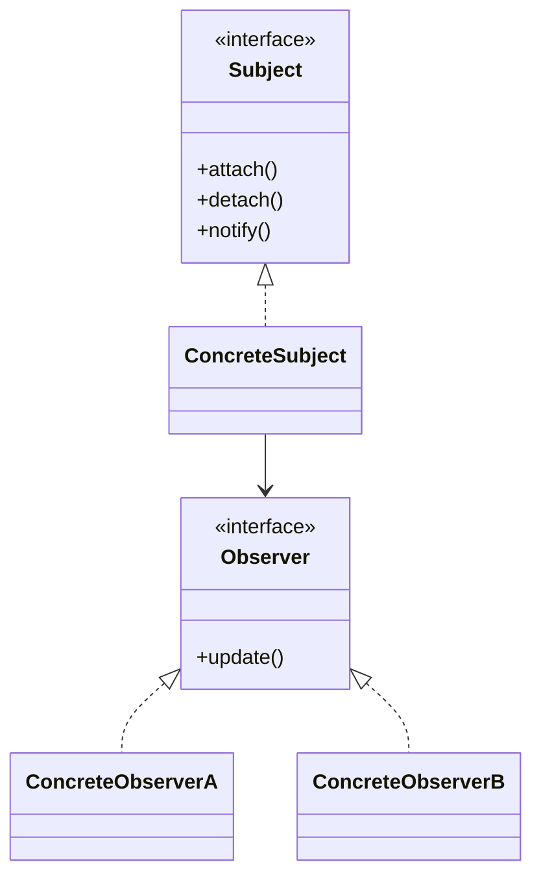

# Observer

## Definition

The **Observer Pattern** is a **behavioral design pattern** that defines a **one-to-many dependency** between objects so that when one object (the **Subject**) changes state, all its dependent objects (the **Observers**) are automatically notified and updated.

It is commonly used to implement **event-driven systems**, publish-subscribe mechanisms, and reactive architectures.

The primary goal is to **maintain consistency among related objects while keeping them loosely coupled**.

---

## Problem It Solves

Suppose you have a weather monitoring system.

Without Observer:

```java
display1.update(weatherData);
display2.update(weatherData);
display3.update(weatherData);
```

Problems:

- The weather station must know every display.
- Tight coupling between sender and receivers.
- Difficult to add new listeners.
- Hard to maintain as the system grows.

The Observer pattern lets displays subscribe and receive updates automatically.

---

## Core Idea

1. Define a `Subject` interface.
2. Observers register themselves with the subject.
3. When the subject's state changes, it notifies all observers.
4. Observers react independently.

Flow:

```text
 Subject Changes
       │
       ▼
Notify Observers
       │
 ┌─────┼─────┐
 ▼     ▼     ▼
Obs1 Obs2 Obs3
```

The subject does not need to know what each observer does with the update.

---

## Real-Life Analogy

Think of a **YouTube channel**.

```text
 YouTube Channel
       │
       ▼
New Video Uploaded
       │
 ┌─────┼─────┐
 ▼     ▼     ▼
User1 User2 User3
```

Subscribers automatically receive notifications whenever new content is published.

The channel is the **Subject**, and subscribers are the **Observers**.

---

## UML Structure



Flow:

```text
     Subject
        │
     notify()
        │
 ┌──────┼──────┐
 ▼      ▼      ▼
Obs A  Obs B  Obs C
```

---

## Java Example

```java
import java.util.ArrayList;
import java.util.List;

interface Observer {

    void update(String news);
}

class Subscriber implements Observer {

    private String name;

    public Subscriber(String name) {
        this.name = name;
    }

    @Override
    public void update(String news) {
        System.out.println(
            name + " received: " + news
        );
    }
}

class NewsChannel {

    private List<Observer> observers =
            new ArrayList<>();

    public void subscribe(Observer observer) {
        observers.add(observer);
    }

    public void unsubscribe(Observer observer) {
        observers.remove(observer);
    }

    public void publishNews(String news) {

        for (Observer observer : observers) {
            observer.update(news);
        }
    }
}

public class Main {

    public static void main(String[] args) {

        NewsChannel channel =
                new NewsChannel();

        Observer alice =
                new Subscriber("Alice");

        Observer bob =
                new Subscriber("Bob");

        channel.subscribe(alice);
        channel.subscribe(bob);

        channel.publishNews(
                "New Design Pattern Article!"
        );
    }
}
```

---

## JavaScript / TypeScript Example

```ts
interface Observer {
  update(news: string): void;
}

class Subscriber implements Observer {
  constructor(private name: string) {}

  update(news: string): void {
    console.log(
      `${this.name} received: ${news}`
    );
  }
}

class NewsChannel {
  private observers: Observer[] = [];

  subscribe(observer: Observer): void {
    this.observers.push(observer);
  }

  unsubscribe(observer: Observer): void {
    this.observers =
      this.observers.filter(
        o => o !== observer
      );
  }

  publishNews(news: string): void {
    for (const observer of this.observers) {
      observer.update(news);
    }
  }
}

const channel = new NewsChannel();

const alice =
  new Subscriber("Alice");

const bob =
  new Subscriber("Bob");

channel.subscribe(alice);
channel.subscribe(bob);

channel.publishNews(
  "New Design Pattern Article!"
);
```

---

## Real Software Example

Observer is commonly used in:

- Event systems
- GUI frameworks
- Message brokers
- Reactive programming
- Publish-Subscribe architectures
- Social media notifications

Examples:

```text
Button Click
      │
      ▼
Event Dispatcher
      │
 ┌────┼────┐
 ▼    ▼    ▼
UI  Logger Analytics
```

Another example:

```text
       Stock Market
             │
             ▼
       Price Update
             │
   ┌─────────┼──────────┐
   ▼         ▼          ▼
Trader App News App Analytics App
```

All observers react independently to the same event.

---

## Advantages

- Promotes loose coupling.
- Supports dynamic subscription and unsubscription.
- Simplifies event-driven architectures.
- Easy to add new observers.
- Follows the Open/Closed Principle.
- Encourages separation of concerns.

---

## Disadvantages

- Notification chains can become difficult to debug.
- Many observers may impact performance.
- Update order is not always guaranteed.
- Risk of memory leaks if observers are not removed.

---

## When to Use

Use Observer when:

- Multiple objects must react to state changes.
- Event-driven communication is required.
- Subscribers should be added dynamically.
- Loose coupling is important.

Examples:

- Notification systems
- UI event handling
- Stock market updates
- Social media feeds
- Messaging systems

---

## When Not to Use

Avoid Observer when:

- Only one object needs updates.
- Direct method calls are simpler.
- Event propagation introduces unnecessary complexity.
- Performance is critical and many observers exist.

---

## Interview Questions

### 1. What is the Observer Pattern?

It is a behavioral pattern that establishes a one-to-many relationship where observers are automatically notified when the subject changes state.

---

### 2. What problem does Observer solve?

It decouples publishers from subscribers and enables automatic notification of state changes.

---

### 3. What are the main participants?

- **Subject**
- **Concrete Subject**
- **Observer**
- **Concrete Observer**

---

### 4. How is Observer different from Mediator?

**Observer**

- One-to-many notifications.
- Observers react independently.

**Mediator**

- Centralizes communication between multiple peers.

---

### 5. What is the Publish-Subscribe model?

A variation of Observer where publishers and subscribers communicate through an event broker rather than directly.

Example:

```text
Publisher
    │
    ▼
Event Bus
    │
 ┌──┼──┐
 ▼  ▼  ▼
S1 S2 S3
```

---

### 6. What are common issues with Observer?

- Memory leaks due to forgotten unsubscriptions.
- Notification storms.
- Difficult debugging of event chains.

---

### 7. What are common real-world examples?

- YouTube subscriptions
- GUI events
- Email notifications
- Social media alerts
- Stock tickers
- Event buses

---

## Memory Trick

> **"One publishes, many listen."**

Think of a **YouTube channel**:

```text
Channel
   │
New Video
   │
 ┌─┼─┐
 ▼ ▼ ▼
Subscribers
```

When the channel uploads a video, every subscriber automatically receives a notification.

The channel is the **Subject** and subscribers are the **Observers**.

---

## Implementation Checklist

- ✅ Define an `Observer` interface.
- ✅ Define a `Subject` interface.
- ✅ Allow observers to subscribe and unsubscribe.
- ✅ Maintain a collection of observers.
- ✅ Notify observers whenever state changes.
- ✅ Keep observers independent of one another.
- ✅ Prevent memory leaks by removing unused observers.
- ✅ Consider asynchronous notifications for large systems.
