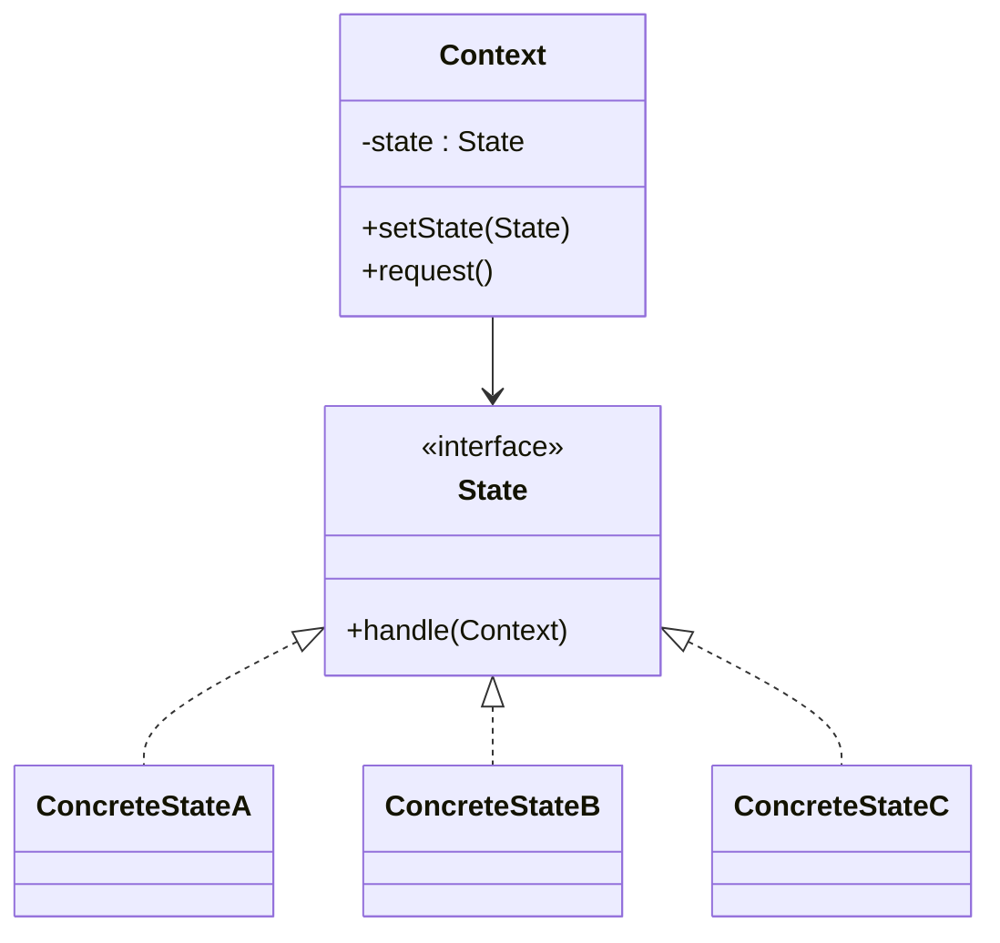

# State

## Definition

The **State Pattern** is a **behavioral design pattern** that allows an object to **change its behavior when its internal state changes**.

Instead of using large conditional statements (`if-else` or `switch`), the object delegates state-specific behavior to separate **State** objects.

The primary goal is to **encapsulate state-dependent behavior and make state transitions explicit**.

---

## Problem It Solves

Suppose you're implementing a media player.

Without State:

```java
if (state == STOPPED) {
    play();
} else if (state == PLAYING) {
    pause();
} else if (state == PAUSED) {
    resume();
}
```

Problems:

- Large `if-else` or `switch` statements.
- Difficult to add new states.
- State transition logic is scattered.
- Violates the Open/Closed Principle.

The State pattern moves each state's behavior into its own class.

---

## Core Idea

1. Define a common `State` interface.
2. Create a concrete class for each state.
3. The `Context` holds the current state.
4. Requests are delegated to the current state.
5. States can transition the context to another state.

Instead of checking state, the context delegates behavior.

---

## Real-Life Analogy

Think of a **traffic light**.

```text
Traffic Light
      │
      ▼
 Red → Green → Yellow → Red
```

Each light behaves differently:

- **Red** → Stop
- **Green** → Go
- **Yellow** → Slow down

The traffic light's behavior changes based on its current state.

---

## UML Structure



Flow:

```text
      Context
         │
         ▼
   Current State
         │
         ▼
  Handles Request
         │
         ▼
Changes State (optional)
```

---

## Java Example

```java
interface State {

    void handle(MediaPlayer player);
}

class PlayingState implements State {

    @Override
    public void handle(MediaPlayer player) {
        System.out.println("Playing music");
        player.setState(new PausedState());
    }
}

class PausedState implements State {

    @Override
    public void handle(MediaPlayer player) {
        System.out.println("Paused");
        player.setState(new PlayingState());
    }
}

class MediaPlayer {

    private State state;

    public MediaPlayer(State state) {
        this.state = state;
    }

    public void setState(State state) {
        this.state = state;
    }

    public void pressButton() {
        state.handle(this);
    }
}

public class Main {

    public static void main(String[] args) {

        MediaPlayer player =
                new MediaPlayer(new PlayingState());

        player.pressButton();

        player.pressButton();
    }
}
```

---

## JavaScript / TypeScript Example

```ts
interface State {
  handle(player: MediaPlayer): void;
}

class PlayingState implements State {
  handle(player: MediaPlayer): void {
    console.log("Playing music");
    player.setState(new PausedState());
  }
}

class PausedState implements State {
  handle(player: MediaPlayer): void {
    console.log("Paused");
    player.setState(new PlayingState());
  }
}

class MediaPlayer {
  constructor(private state: State) {}

  setState(state: State): void {
    this.state = state;
  }

  pressButton(): void {
    this.state.handle(this);
  }
}

const player = new MediaPlayer(
  new PlayingState()
);

player.pressButton();
player.pressButton();
```

---

## Real Software Example

State is commonly used in:

- Media players
- Game character behavior
- TCP connection lifecycle
- Order processing systems
- Vending machines
- Workflow engines

Examples:

```text
Order

Pending
   │
   ▼
 Paid
   │
   ▼
Shipped
   │
   ▼
Delivered
```

Another example:

```text
TCP Connection

 Closed
   │
   ▼
Listening
   │
   ▼
Established
   │
   ▼
 Closed
```

Each state defines different behavior.

---

## Advantages

- Eliminates large conditional statements.
- Encapsulates state-specific behavior.
- Makes state transitions explicit.
- Simplifies adding new states.
- Follows the Open/Closed Principle.
- Improves readability and maintainability.

---

## Disadvantages

- Introduces additional classes.
- Can increase complexity for simple state machines.
- Many states may lead to many small classes.
- State transition logic must be designed carefully.

---

## When to Use

Use State when:

- Object behavior depends on its current state.
- Large `if-else` or `switch` statements exist.
- State transitions change behavior significantly.
- States are expected to grow over time.

Examples:

- Traffic lights
- Game AI
- Media players
- Order workflows
- ATM machines

---

## When Not to Use

Avoid State when:

- There are very few simple states.
- Behavior rarely changes.
- Conditional logic is minimal.
- Introducing many classes would overcomplicate the design.

---

## Interview Questions

### 1. What is the State Pattern?

It is a behavioral pattern that allows an object to change its behavior dynamically by delegating behavior to state objects.

---

### 2. What problem does State solve?

It removes complex conditional logic and encapsulates behavior associated with each state.

---

### 3. What are the main participants?

- **Context**
- **State**
- **Concrete States**

The context delegates requests to the current state.

---

### 4. How is State different from Strategy?

**State**

- Behavior changes automatically based on internal state.
- States often transition to other states.

**Strategy**

- Algorithm is selected externally.
- Strategies are usually independent of one another.

---

### 5. Can states change the context?

Yes.

A state can transition the context to another state after handling a request.

Example:

```text
 Playing
    │
  Pause
    ▼
 Paused
```

---

### 6. What are common real-world examples?

- Media players
- TCP connections
- Vending machines
- Game characters
- Order lifecycles
- Traffic lights

---

### 7. Which design principle does State emphasize?

It strongly promotes:

- **Open/Closed Principle**
- **Single Responsibility Principle**
- **Composition over Inheritance**

---

## Memory Trick

> **"Same object, different behavior depending on its state."**

Think of a **traffic light**:

```text
Red
 │
 ▼
Green
 │
 ▼
Yellow
 │
 ▼
Red
```

The traffic light is the same object, but its behavior changes based on its current state.

---

## Implementation Checklist

- ✅ Identify state-dependent behavior.
- ✅ Create a common `State` interface.
- ✅ Implement each state as a separate class.
- ✅ Store the current state inside the `Context`.
- ✅ Delegate requests to the current state.
- ✅ Allow states to transition the context when appropriate.
- ✅ Replace large conditional statements with state objects.
- ✅ Keep each state focused on its own behavior and transitions.
