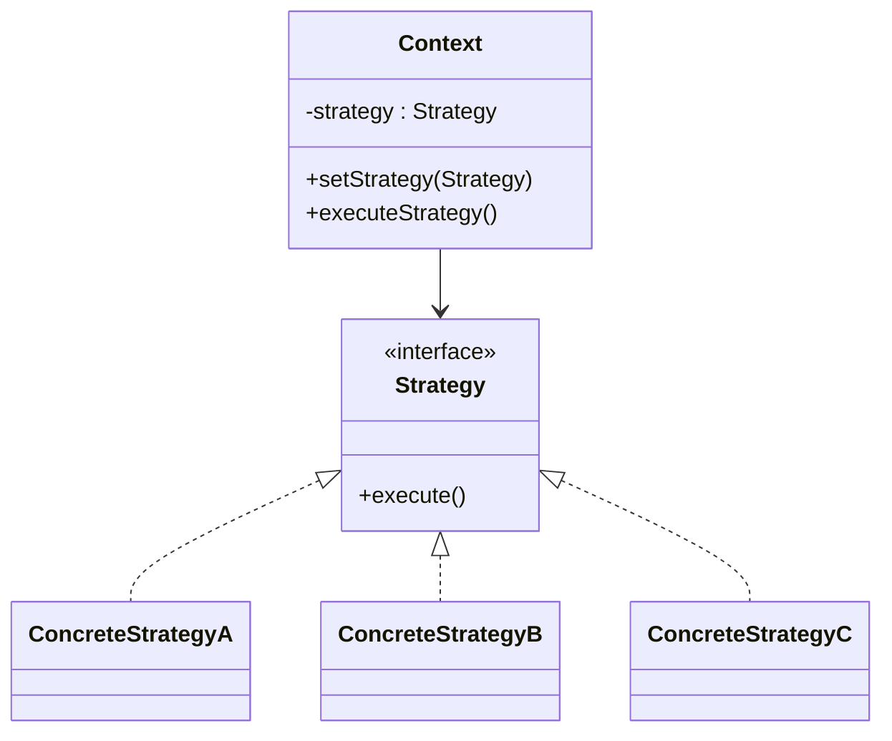

# Strategy

## Definition

The **Strategy Pattern** is a **behavioral design pattern** that defines a family of algorithms, encapsulates each one in a separate class, and makes them interchangeable at runtime.

Instead of hardcoding an algorithm inside a class, the class delegates the work to a **Strategy** object. This allows the algorithm to change without modifying the client code.

The primary goal is to **separate algorithms from the objects that use them and enable runtime selection of behavior**.

---

## Problem It Solves

Suppose an e-commerce application supports multiple payment methods.

Without Strategy:

```java
if (paymentType.equals("CARD")) {
    payByCard();
} else if (paymentType.equals("UPI")) {
    payByUPI();
} else if (paymentType.equals("PAYPAL")) {
    payByPaypal();
}
```

Problems:

- Large `if-else` or `switch` statements.
- Difficult to add new payment methods.
- Violates the Open/Closed Principle.
- Business logic becomes tightly coupled to payment implementations.

The Strategy pattern encapsulates each payment algorithm into its own class.

---

## Core Idea

1. Define a common `Strategy` interface.
2. Create a concrete strategy class for each algorithm.
3. The `Context` holds a reference to a strategy.
4. The client chooses which strategy to use.
5. The context delegates execution to the selected strategy.

The algorithm can be changed at runtime without modifying the context.

---

## Real-Life Analogy

Think of using a **navigation app**.

```text
 Destination
      │
      ▼
Choose Route
 ├── Car
 ├── Bike
 ├── Walking
 └── Public Transport
```

The destination remains the same, but the route algorithm changes depending on the selected travel mode.

Each route calculation is a different **Strategy**.

---

## UML Structure



Flow:

```text
Client
   │
Select Strategy
   │
   ▼
Context
   │
   ▼
Strategy.execute()
```

---

## Java Example

```java
interface PaymentStrategy {

    void pay(int amount);
}

class CreditCardPayment implements PaymentStrategy {

    @Override
    public void pay(int amount) {
        System.out.println(
            "Paid ₹" + amount + " using Credit Card"
        );
    }
}

class UpiPayment implements PaymentStrategy {

    @Override
    public void pay(int amount) {
        System.out.println(
            "Paid ₹" + amount + " using UPI"
        );
    }
}

class ShoppingCart {

    private PaymentStrategy strategy;

    public void setStrategy(
            PaymentStrategy strategy
    ) {
        this.strategy = strategy;
    }

    public void checkout(int amount) {
        strategy.pay(amount);
    }
}

public class Main {

    public static void main(String[] args) {

        ShoppingCart cart =
                new ShoppingCart();

        cart.setStrategy(
                new CreditCardPayment());

        cart.checkout(2500);

        cart.setStrategy(
                new UpiPayment());

        cart.checkout(500);
    }
}
```

---

## JavaScript / TypeScript Example

```ts
interface PaymentStrategy {
  pay(amount: number): void;
}

class CreditCardPayment
  implements PaymentStrategy {

  pay(amount: number): void {
    console.log(
      `Paid ₹${amount} using Credit Card`
    );
  }
}

class UpiPayment
  implements PaymentStrategy {

  pay(amount: number): void {
    console.log(
      `Paid ₹${amount} using UPI`
    );
  }
}

class ShoppingCart {
  constructor(
    private strategy: PaymentStrategy
  ) {}

  setStrategy(
    strategy: PaymentStrategy
  ): void {
    this.strategy = strategy;
  }

  checkout(amount: number): void {
    this.strategy.pay(amount);
  }
}

const cart =
  new ShoppingCart(
    new CreditCardPayment()
  );

cart.checkout(2500);

cart.setStrategy(
  new UpiPayment()
);

cart.checkout(500);
```

---

## Real Software Example

Strategy is commonly used in:

- Payment gateways
- Sorting algorithms
- Compression algorithms
- Authentication providers
- Route planning
- Pricing engines

Examples:

```text
Payment

Credit Card
UPI
PayPal
Net Banking
```

Each payment method is a separate strategy.

Another example:

```text
Compression

ZIP
RAR
7z
GZIP
```

The application selects the appropriate compression strategy at runtime.

---

## Advantages

- Eliminates large conditional statements.
- Algorithms can be changed at runtime.
- Encourages composition over inheritance.
- Makes algorithms reusable.
- Follows the Open/Closed Principle.
- Simplifies testing individual algorithms.

---

## Disadvantages

- Introduces additional classes.
- Clients must understand available strategies.
- May increase complexity for simple applications.
- Choosing the wrong strategy can produce incorrect behavior.

---

## When to Use

Use Strategy when:

- Multiple algorithms solve the same problem.
- Algorithms should be interchangeable.
- Runtime behavior selection is required.
- Large conditional statements exist.

Examples:

- Payment systems
- Discount calculations
- Route planning
- Data compression
- Authentication providers

---

## When Not to Use

Avoid Strategy when:

- Only one algorithm exists.
- Algorithms rarely change.
- Conditional logic is minimal.
- Extra abstraction provides little benefit.

---

## Interview Questions

### 1. What is the Strategy Pattern?

It is a behavioral pattern that encapsulates interchangeable algorithms into separate classes and allows selecting one at runtime.

---

### 2. What problem does Strategy solve?

It removes complex conditional logic by separating algorithms from the objects that use them.

---

### 3. What are the main participants?

- **Strategy**
- **Concrete Strategy**
- **Context**
- **Client**

---

### 4. How is Strategy different from State?

**Strategy**

- Client selects the algorithm.
- Strategies are usually independent.

**State**

- Behavior changes automatically based on internal state.
- States often transition to other states.

---

### 5. How is Strategy different from Command?

**Strategy**

- Encapsulates an algorithm.

**Command**

- Encapsulates a request or action.

Strategy answers **"How should it be done?"**, while Command answers **"What should be done?"**.

---

### 6. What are common real-world examples?

- Payment methods
- Sorting algorithms
- Compression algorithms
- Authentication providers
- Navigation routes
- Pricing strategies

---

### 7. Which design principle does Strategy emphasize?

It strongly promotes:

- **Composition over Inheritance**
- **Open/Closed Principle**
- **Single Responsibility Principle**

---

## Memory Trick

> **"Same task, different algorithms."**

Think of a **navigation app**:

```text
Destination
     │
Choose Route
 ├── Car
 ├── Bike
 ├── Walk
 └── Bus
```

The destination stays the same, but you can switch the route algorithm at any time.

Each route option is a **Strategy**.

---

## Implementation Checklist

- ✅ Identify algorithms that vary.
- ✅ Create a common `Strategy` interface.
- ✅ Implement each algorithm as a separate strategy class.
- ✅ Store a strategy reference inside the `Context`.
- ✅ Allow clients to change the strategy at runtime.
- ✅ Delegate algorithm execution to the selected strategy.
- ✅ Replace large conditional statements with strategy objects.
- ✅ Keep each strategy focused on a single algorithm.
