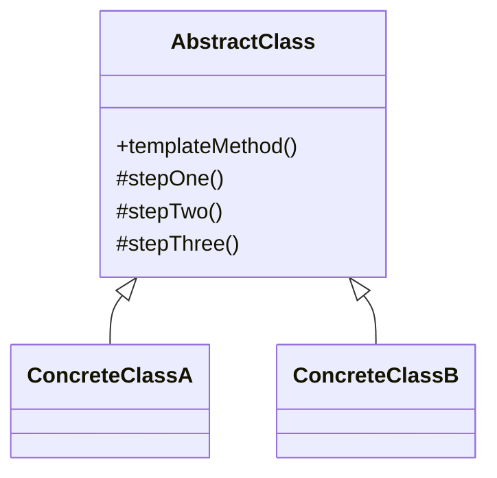

# Template Method

## Definition

The **Template Method Pattern** is a **behavioral design pattern** that **defines the skeleton of an algorithm in a base class while allowing subclasses to override specific steps without changing the overall algorithm structure**.

The template method fixes the order of operations, while subclasses customize only the variable parts.

The primary goal is to **promote code reuse by moving common workflow into a superclass and allowing controlled customization**.

---

## Problem It Solves

Suppose you're implementing data processing for different file types.

Without Template Method:

```java
readFile();
validate();
process();
save();
```

Every class duplicates the same workflow with only small differences.

Problems:

- Duplicate code.
- Difficult to maintain.
- Changes to workflow must be repeated everywhere.
- High chance of inconsistency.

The Template Method centralizes the algorithm while allowing subclasses to customize specific steps.

---

## Core Idea

1. Create an abstract base class.
2. Implement a **template method** containing the fixed algorithm.
3. Declare certain steps as abstract (or overridable).
4. Subclasses implement only the variable steps.
5. The overall execution order remains unchanged.

The superclass controls **how** the algorithm runs.

---

## Real-Life Analogy

Think of **making tea and coffee**.

Common steps:

```text
  Boil Water
      │
      ▼
Add Main Ingredient
      │
      ▼
Pour into Cup
      │
      ▼
    Serve
```

Differences:

- Tea → Add tea leaves
- Coffee → Add coffee powder

The overall recipe stays the same, but one step changes.

---

## UML Structure



Flow:

```text
Template Method
      │
      ▼
Step 1 (Fixed)
      │
      ▼
Step 2 (Subclass)
      │
      ▼
Step 3 (Fixed)
```

---

## Java Example

```java
abstract class Beverage {

    public final void prepare() {

        boilWater();

        brew();

        pourInCup();

        addCondiments();
    }

    private void boilWater() {
        System.out.println("Boiling water");
    }

    protected abstract void brew();

    private void pourInCup() {
        System.out.println("Pouring into cup");
    }

    protected abstract void addCondiments();
}

class Tea extends Beverage {

    @Override
    protected void brew() {
        System.out.println("Steeping tea");
    }

    @Override
    protected void addCondiments() {
        System.out.println("Adding lemon");
    }
}

class Coffee extends Beverage {

    @Override
    protected void brew() {
        System.out.println("Brewing coffee");
    }

    @Override
    protected void addCondiments() {
        System.out.println("Adding sugar");
    }
}

public class Main {

    public static void main(String[] args) {

        Beverage tea = new Tea();

        tea.prepare();

        System.out.println();

        Beverage coffee = new Coffee();

        coffee.prepare();
    }
}
```

---

## JavaScript / TypeScript Example

```ts
abstract class Beverage {

  prepare(): void {

    this.boilWater();

    this.brew();

    this.pourInCup();

    this.addCondiments();
  }

  private boilWater(): void {
    console.log("Boiling water");
  }

  protected abstract brew(): void;

  private pourInCup(): void {
    console.log("Pouring into cup");
  }

  protected abstract addCondiments(): void;
}

class Tea extends Beverage {

  protected brew(): void {
    console.log("Steeping tea");
  }

  protected addCondiments(): void {
    console.log("Adding lemon");
  }
}

class Coffee extends Beverage {

  protected brew(): void {
    console.log("Brewing coffee");
  }

  protected addCondiments(): void {
    console.log("Adding sugar");
  }
}

new Tea().prepare();

console.log();

new Coffee().prepare();
```

---

## Real Software Example

Template Method is commonly used in:

- Java Servlet lifecycle
- Spring Framework
- JUnit test execution
- Data import/export pipelines
- Build systems
- Game engines

Examples:

```text
Spring Bean Initialization

Create Bean
     │
     ▼
Inject Dependencies
     │
     ▼
@PostConstruct
```

Another example:

```text
JUnit Test

setUp()
   │
   ▼
runTest()
   │
   ▼
tearDown()
```

The framework controls the workflow while developers implement specific steps.

---

## Advantages

- Eliminates duplicate code.
- Reuses common workflow.
- Controls algorithm structure.
- Makes customization easy.
- Follows the Open/Closed Principle.
- Improves maintainability.

---

## Disadvantages

- Relies on inheritance.
- Can create rigid class hierarchies.
- Changes to the template affect all subclasses.
- Too many hooks can make the design difficult to understand.

---

## When to Use

Use Template Method when:

- Multiple classes share the same workflow.
- Only certain algorithm steps differ.
- You want to enforce execution order.
- Code reuse is important.

Examples:

- File processing
- Test frameworks
- Data pipelines
- Report generation
- Framework lifecycles

---

## When Not to Use

Avoid Template Method when:

- Algorithms differ significantly.
- Composition is preferred over inheritance.
- Runtime algorithm switching is required (use Strategy instead).
- There is little shared workflow.

---

## Interview Questions

### 1. What is the Template Method Pattern?

It is a behavioral pattern that defines the structure of an algorithm in a superclass while allowing subclasses to customize specific steps.

---

### 2. What problem does Template Method solve?

It removes duplicated workflow code by placing common logic in a base class and leaving variable parts to subclasses.

---

### 3. What are the main participants?

- **Abstract Class**
- **Template Method**
- **Concrete Classes**

The abstract class controls the algorithm, while subclasses implement customizable steps.

---

### 4. How is Template Method different from Strategy?

**Template Method**

- Uses inheritance.
- Algorithm structure is fixed.
- Subclasses override specific steps.

**Strategy**

- Uses composition.
- Entire algorithm can be replaced at runtime.

---

### 5. What is a hook method?

A hook is an optional method with a default implementation that subclasses may override.

Example:

```java
protected boolean shouldLog() {
    return false;
}
```

---

### 6. What are common real-world examples?

- Java Servlets
- Spring Framework
- JUnit lifecycle
- Build tools
- Report generation
- Data processing pipelines

---

### 7. Which design principles does Template Method emphasize?

It strongly promotes:

- **Don't Repeat Yourself (DRY)**
- **Open/Closed Principle**
- **Hollywood Principle** ("Don't call us, we'll call you.")

---

## Memory Trick

> **"Same recipe, different ingredients."**

Think of preparing beverages:

```text
 Boil Water
     │
     ▼
   Brew
     │
     ▼
   Pour
     │
     ▼
 Add Extras
```

Tea and coffee follow the same recipe, but customize the brewing and ingredients.

The recipe is the **Template Method**.

---

## Implementation Checklist

- ✅ Identify the common workflow.
- ✅ Create an abstract base class.
- ✅ Implement the template method with the fixed algorithm.
- ✅ Mark variable steps as abstract or overridable.
- ✅ Let subclasses implement only the customizable steps.
- ✅ Prevent subclasses from changing the algorithm order (e.g., make the template method `final` in Java).
- ✅ Keep common logic in the superclass.
- ✅ Use hook methods for optional behavior when needed.
