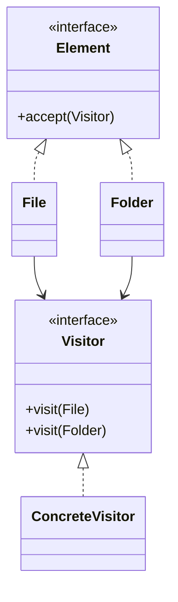

# Visitor

## Definition

The **Visitor Pattern** is a **behavioral design pattern** that lets you **add new operations to existing object structures without modifying their classes**.

Instead of placing every operation inside the objects themselves, the operation is moved into a separate **Visitor** class. Objects simply **accept** visitors and allow them to perform operations.

The primary goal is to **separate algorithms from the objects they operate on**.

---

## Problem It Solves

Suppose you have a file system containing:

- Files
- Folders
- Shortcuts

Now you want to perform multiple operations:

- Calculate size
- Generate report
- Scan for viruses
- Export metadata

Without Visitor:

```java
class File {
    calculateSize();
    export();
    scanVirus();
    print();
}
```

Every new operation requires modifying every class.

Problems:

- Violates the Open/Closed Principle.
- Classes become bloated.
- Difficult to maintain.

The Visitor pattern moves operations into separate visitor classes.

---

## Core Idea

1. Define a `Visitor` interface.
2. Each object implements an `accept()` method.
3. The visitor visits each object.
4. Different visitors perform different operations.
5. New operations are added by creating new visitors instead of modifying existing classes.

This uses **Double Dispatch** to select the correct operation.

---

## Real-Life Analogy

Think of a **doctor visiting patients**.

```text
Doctor
   │
   ▼
Patient A
Patient B
Patient C
```

Each patient accepts the doctor.

The doctor performs different actions depending on the patient.

Later, a **nutritionist** can visit the same patients without changing the patients themselves.

Visitors represent different specialists.

---

## UML Structure



Flow:

```text
 Visitor
    │
    ▼
accept(visitor)
    │
    ▼
visit(Element)
```

---

## Java Example

```java
interface Visitor {

    void visit(Book book);

    void visit(DVD dvd);
}

interface Item {

    void accept(Visitor visitor);
}

class Book implements Item {

    @Override
    public void accept(Visitor visitor) {
        visitor.visit(this);
    }
}

class DVD implements Item {

    @Override
    public void accept(Visitor visitor) {
        visitor.visit(this);
    }
}

class PriceVisitor implements Visitor {

    @Override
    public void visit(Book book) {
        System.out.println("Book Price: ₹500");
    }

    @Override
    public void visit(DVD dvd) {
        System.out.println("DVD Price: ₹300");
    }
}

public class Main {

    public static void main(String[] args) {

        Visitor visitor = new PriceVisitor();

        Item[] items = {
                new Book(),
                new DVD()
        };

        for (Item item : items) {
            item.accept(visitor);
        }
    }
}
```

---

## JavaScript / TypeScript Example

```ts
interface Visitor {
  visitBook(book: Book): void;
  visitDVD(dvd: DVD): void;
}

interface Item {
  accept(visitor: Visitor): void;
}

class Book implements Item {
  accept(visitor: Visitor): void {
    visitor.visitBook(this);
  }
}

class DVD implements Item {
  accept(visitor: Visitor): void {
    visitor.visitDVD(this);
  }
}

class PriceVisitor implements Visitor {

  visitBook(book: Book): void {
    console.log("Book Price: ₹500");
  }

  visitDVD(dvd: DVD): void {
    console.log("DVD Price: ₹300");
  }
}

const visitor = new PriceVisitor();

const items: Item[] = [
  new Book(),
  new DVD(),
];

items.forEach(item =>
  item.accept(visitor)
);
```

---

## Real Software Example

Visitor is commonly used in:

- Compiler syntax trees (AST)
- XML/HTML parsers
- Code analyzers
- Report generators
- File system traversal
- Object serialization

Examples:

```text
Abstract Syntax Tree

   Expression
    Statement
    Variable
        │
        ▼
Type Checking Visitor
```

Another example:

```text
Document

   Paragraph
     Image
     Table
       │
       ▼
PDF Export Visitor
```

The same document structure can be exported to PDF, HTML, or Markdown using different visitors.

---

## Advantages

- Easily adds new operations.
- Keeps element classes simple.
- Follows the Open/Closed Principle for operations.
- Groups related operations together.
- Makes complex algorithms easier to organize.
- Works well with stable object structures.

---

## Disadvantages

- Adding new element types requires updating every visitor.
- Introduces additional classes.
- Double dispatch can be difficult to understand.
- Not suitable when object structures change frequently.

---

## When to Use

Use Visitor when:

- Object structure is stable.
- New operations are added frequently.
- Operations should be separated from data.
- Multiple unrelated operations exist.

Examples:

- Compilers
- AST traversal
- File systems
- Reporting
- Serialization
- Document processing

---

## When Not to Use

Avoid Visitor when:

- New element types are added frequently.
- Object hierarchy changes often.
- Only a few operations exist.
- Simpler polymorphism is sufficient.

---

## Interview Questions

### 1. What is the Visitor Pattern?

It is a behavioral pattern that separates operations from the objects they operate on by placing those operations in visitor classes.

---

### 2. What problem does Visitor solve?

It allows adding new operations without modifying existing object classes.

---

### 3. What are the main participants?

- **Visitor**
- **Concrete Visitor**
- **Element**
- **Concrete Element**
- **Client**

---

### 4. What is Double Dispatch?

Double Dispatch determines the method to execute based on:

- The type of the visitor.
- The type of the element being visited.

Example:

```java
element.accept(visitor);
```

calls the correct:

```java
visitor.visit(element);
```

---

### 5. How is Visitor different from Strategy?

**Visitor**

- Adds new operations to an object structure.
- Operations are external to the objects.

**Strategy**

- Replaces an algorithm used by an object.
- Behavior is selected at runtime.

---

### 6. What is the biggest drawback of Visitor?

Adding a new element type requires modifying every visitor implementation.

---

### 7. What are common real-world examples?

- Compiler AST visitors
- XML parsers
- HTML renderers
- Report generators
- File system analyzers
- Code formatters

---

## Memory Trick

> **"Same objects, different visitors."**

Think of a **hospital**:

```text
             Patients
                 │
   ┌─────────────┼─────────────┐
   ▼             ▼             ▼
Doctor    Nutritionist  Physiotherapist
```

The patients remain the same, but different specialists perform different operations on them.

Each specialist is a **Visitor**.

---

## Implementation Checklist

- ✅ Identify a stable object structure.
- ✅ Create a `Visitor` interface with a visit method for each element type.
- ✅ Add an `accept()` method to every element.
- ✅ Implement concrete visitors for different operations.
- ✅ Use double dispatch (`accept()` → `visit()`) to invoke the correct method.
- ✅ Keep operations inside visitors instead of element classes.
- ✅ Add new functionality by creating new visitors rather than modifying elements.
- ✅ Avoid Visitor if element types change frequently.
