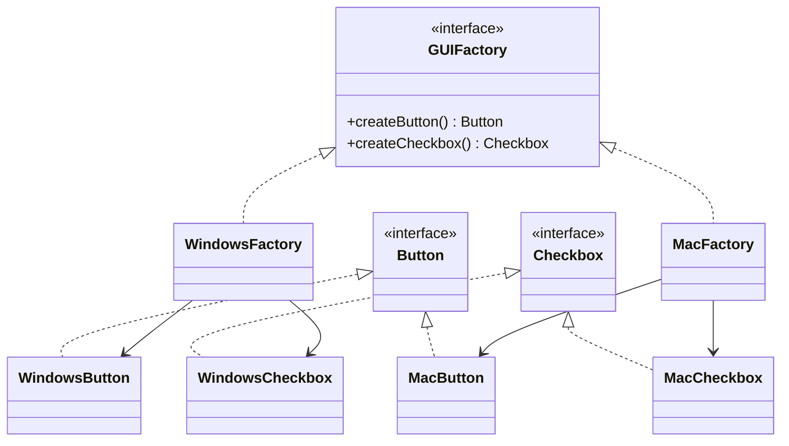

# Abstract Factory

## Definition

The **Abstract Factory Pattern** is a **creational design pattern** that provides an interface for creating **families of related or dependent objects** without specifying their concrete classes.

Instead of creating individual objects directly, the client uses a factory that produces an entire set of compatible objects.

The main goal is to ensure that related objects work together while keeping client code independent of concrete implementations.

---

## Problem It Solves

Suppose an application supports multiple operating systems.

For each platform, it needs compatible UI components:

- **Windows Button**
- **Windows Checkbox**

or

- **Mac Button**
- **Mac Checkbox**

Without Abstract Factory:

```java
Button button = new WindowsButton();
Checkbox checkbox = new MacCheckbox();
```

This could accidentally mix incompatible products.

The Abstract Factory ensures that all created objects belong to the **same family**.

---

## Core Idea

1. Define abstract product interfaces.
2. Define an abstract factory interface.
3. Create concrete factories for each product family.
4. Each concrete factory creates matching products.
5. Client works only with abstract interfaces.

The client never directly instantiates concrete products.

---

## Real-Life Analogy

Imagine buying furniture from a **furniture showroom**.

You choose a collection:

- Modern Collection
  - Modern Chair
  - Modern Table
  - Modern Sofa

or

- Victorian Collection
  - Victorian Chair
  - Victorian Table
  - Victorian Sofa

The showroom ensures all pieces belong to the same style and are compatible.

You don't mix a Victorian chair with a modern sofa unintentionally.

---

## UML Structure



Flow:

```text
              Client
                 │
                 ▼
        Abstract Factory
                 │
        ┌────────┴────────┐
        ▼                 ▼
 WindowsFactory      MacFactory
      │                    │
 ┌────┴────┐         ┌─────┴─────┐
 ▼         ▼         ▼           ▼
Button  Checkbox   Button    Checkbox
```

---

## Java Example

```java
interface Button {
    void render();
}

interface Checkbox {
    void check();
}

class WindowsButton implements Button {

    @Override
    public void render() {
        System.out.println("Windows Button");
    }
}

class WindowsCheckbox implements Checkbox {

    @Override
    public void check() {
        System.out.println("Windows Checkbox");
    }
}

class MacButton implements Button {

    @Override
    public void render() {
        System.out.println("Mac Button");
    }
}

class MacCheckbox implements Checkbox {

    @Override
    public void check() {
        System.out.println("Mac Checkbox");
    }
}

interface GUIFactory {

    Button createButton();

    Checkbox createCheckbox();
}

class WindowsFactory implements GUIFactory {

    @Override
    public Button createButton() {
        return new WindowsButton();
    }

    @Override
    public Checkbox createCheckbox() {
        return new WindowsCheckbox();
    }
}

class MacFactory implements GUIFactory {

    @Override
    public Button createButton() {
        return new MacButton();
    }

    @Override
    public Checkbox createCheckbox() {
        return new MacCheckbox();
    }
}

public class Main {

    public static void main(String[] args) {

        GUIFactory factory = new WindowsFactory();

        Button button = factory.createButton();
        Checkbox checkbox = factory.createCheckbox();

        button.render();
        checkbox.check();
    }
}
```

---

## JavaScript / TypeScript Example

```ts
interface Button {
  render(): void;
}

interface Checkbox {
  check(): void;
}

class WindowsButton implements Button {
  render(): void {
    console.log("Windows Button");
  }
}

class WindowsCheckbox implements Checkbox {
  check(): void {
    console.log("Windows Checkbox");
  }
}

class MacButton implements Button {
  render(): void {
    console.log("Mac Button");
  }
}

class MacCheckbox implements Checkbox {
  check(): void {
    console.log("Mac Checkbox");
  }
}

interface GUIFactory {
  createButton(): Button;
  createCheckbox(): Checkbox;
}

class WindowsFactory implements GUIFactory {
  createButton(): Button {
    return new WindowsButton();
  }

  createCheckbox(): Checkbox {
    return new WindowsCheckbox();
  }
}

class MacFactory implements GUIFactory {
  createButton(): Button {
    return new MacButton();
  }

  createCheckbox(): Checkbox {
    return new MacCheckbox();
  }
}

const factory: GUIFactory = new WindowsFactory();

const button = factory.createButton();
const checkbox = factory.createCheckbox();

button.render();
checkbox.check();
```

---

## Real Software Example

Abstract Factory is commonly used in:

- Cross-platform UI frameworks
- Database driver families
- Theme systems (Light/Dark)
- Cloud provider SDKs
- Payment gateway integrations
- Widget libraries

Example:

```text
Windows Factory
      │
 ┌────┴─────────┐
 ▼              ▼
Button      Checkbox

Mac Factory
      │
 ┌────┴─────────┐
 ▼              ▼
Button      Checkbox
```

Java's `javax.xml.parsers.DocumentBuilderFactory` is also an example of the Abstract Factory concept.

---

## Advantages

- Ensures compatible products are created together.
- Hides concrete implementation details.
- Promotes loose coupling.
- Supports the Open/Closed Principle.
- Makes switching between product families easy.
- Improves consistency across related objects.

---

## Disadvantages

- Adds many interfaces and classes.
- Can become complex for small projects.
- Adding a new product type requires updating every factory implementation.
- Higher initial design overhead.

---

## When to Use

Use Abstract Factory when:

- You need families of related objects.
- Products must be used together.
- The application supports multiple themes or platforms.
- You want to swap entire product families easily.
- Consistency among products is important.

Examples:

- Windows vs macOS UI components
- Dark vs Light themes
- SQL vs NoSQL providers
- Cloud service providers

---

## When Not to Use

Avoid Abstract Factory when:

- Only one product type exists.
- Product families are unlikely to expand.
- Simple Factory or Factory Method is sufficient.
- The additional abstraction introduces unnecessary complexity.

---

## Interview Questions

### 1. What is the Abstract Factory Pattern?

It is a creational pattern that provides an interface for creating families of related objects without specifying their concrete classes.

---

### 2. What problem does it solve?

It ensures that compatible objects are created together while hiding concrete implementations from the client.

---

### 3. How is it different from Factory Method?

**Factory Method**

- Creates **one product**.
- Subclasses determine which product to instantiate.

**Abstract Factory**

- Creates **multiple related products**.
- Produces entire families of compatible objects.

Example:

```text
Factory Method
      │
      ▼
   Button

Abstract Factory
      │
 ┌────┴─────┐
 ▼          ▼
Button   Checkbox
```

---

### 4. Which SOLID principle does it support?

Primarily the **Open/Closed Principle** and **Dependency Inversion Principle** by programming against abstractions.

---

### 5. What is meant by a "product family"?

A group of related objects designed to work together.

Example:

```text
Windows:
- Button
- Checkbox
- Menu

Mac:
- Button
- Checkbox
- Menu
```

---

### 6. What are common real-world examples?

- Cross-platform GUI toolkits
- Theme engines
- Cloud SDKs
- Payment provider integrations
- Widget libraries

---

### 7. What is the biggest disadvantage?

Adding a **new product type** (for example, `Menu`) requires modifying every existing concrete factory to implement `createMenu()`.

---

## Memory Trick

> **"One factory creates an entire family."**

Think of buying a **complete furniture collection**.

Instead of purchasing each item separately, one showroom provides a matching:

- Chair
- Table
- Sofa

All belong to the same style and fit together perfectly.

---

## Implementation Checklist

- ✅ Identify related product families.
- ✅ Define abstract product interfaces.
- ✅ Create concrete implementations for each family.
- ✅ Define an abstract factory interface.
- ✅ Implement one concrete factory per product family.
- ✅ Ensure each factory produces only compatible products.
- ✅ Keep client code dependent only on abstract factories and abstract products.
