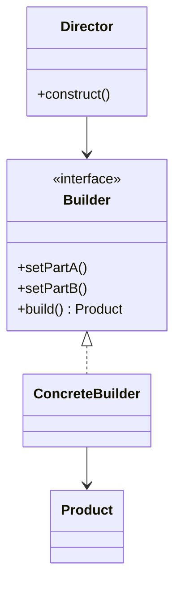

# Builder

## Definition

The **Builder Pattern** is a **creational design pattern** that separates the **construction of a complex object from its representation**, allowing the same construction process to create different configurations of the object.

Instead of passing many constructor parameters, the object is built **step by step** using a builder.

---

## Problem It Solves

Some objects require many optional or configurable parameters.

Without Builder:

```java
User user = new User(
    "Alice",
    25,
    "alice@example.com",
    "Mumbai",
    "India",
    true,
    "1234567890"
);
```

Problems:

- Constructors become long and difficult to read.
- Multiple overloaded constructors lead to the **Telescoping Constructor Problem**.
- It's easy to pass parameters in the wrong order.
- Optional fields make constructors confusing.

The Builder pattern provides a readable and flexible way to construct such objects.

---

## Core Idea

1. Create a separate `Builder` class.
2. Configure the object step by step using method chaining.
3. Call `build()` to produce the final object.
4. The client controls which optional values are provided.

This results in clean and expressive object creation.

---

## Real-Life Analogy

Imagine ordering a **custom burger**.

You choose:

- Bread
- Patty
- Cheese
- Sauce
- Vegetables
- Extras

The chef assembles everything based on your choices and hands you the final burger.

You don't need a separate constructor for every possible burger combination.

---

## UML Structure



Flow:

```text
      Client
         │
         ▼
      Builder
         │
 ┌───────┼────────┐
 ▼       ▼        ▼
setA() setB() setC()
         │
         ▼
      build()
         │
         ▼
    Final Object
```

> **Note:** In many modern implementations (especially Java and TypeScript), the `Director` is omitted and the client interacts directly with the builder.

---

## Java Example

```java
class User {

    private String name;
    private int age;
    private String email;

    private User(Builder builder) {
        this.name = builder.name;
        this.age = builder.age;
        this.email = builder.email;
    }

    public void display() {
        System.out.println(name + " " + age + " " + email);
    }

    public static class Builder {

        private String name;
        private int age;
        private String email;

        public Builder setName(String name) {
            this.name = name;
            return this;
        }

        public Builder setAge(int age) {
            this.age = age;
            return this;
        }

        public Builder setEmail(String email) {
            this.email = email;
            return this;
        }

        public User build() {
            return new User(this);
        }
    }
}

public class Main {

    public static void main(String[] args) {

        User user = new User.Builder()
                .setName("Alice")
                .setAge(25)
                .setEmail("alice@example.com")
                .build();

        user.display();
    }
}
```

---

## JavaScript / TypeScript Example

```ts
class User {
  constructor(
    public name: string,
    public age: number,
    public email: string
  ) {}
}

class UserBuilder {
  private name = "";
  private age = 0;
  private email = "";

  setName(name: string): UserBuilder {
    this.name = name;
    return this;
  }

  setAge(age: number): UserBuilder {
    this.age = age;
    return this;
  }

  setEmail(email: string): UserBuilder {
    this.email = email;
    return this;
  }

  build(): User {
    return new User(this.name, this.age, this.email);
  }
}

const user = new UserBuilder()
  .setName("Alice")
  .setAge(25)
  .setEmail("alice@example.com")
  .build();

console.log(user);
```

---

## Real Software Example

Builder is commonly used in:

- SQL query builders
- HTTP request builders
- Configuration objects
- Complex UI component creation
- Document generation APIs
- Immutable object creation

Examples:

- `StringBuilder` in Java
- `OkHttp Request.Builder`
- `Lombok @Builder`
- `HttpRequest.Builder` in Java 11

Example flow:

```text
Request.Builder
      │
      ├── setUrl()
      ├── addHeader()
      ├── setMethod()
      └── build()
               │
               ▼
        HTTP Request Object
```

---

## Advantages

- Eliminates telescoping constructors.
- Makes object creation more readable.
- Supports optional parameters naturally.
- Improves maintainability.
- Enables immutable objects.
- Separates construction logic from business logic.
- Method chaining creates fluent APIs.

---

## Disadvantages

- Requires additional builder classes.
- Adds boilerplate code for simple objects.
- Slightly increases implementation complexity.
- May be unnecessary when objects have very few fields.

---

## When to Use

Use Builder when:

- Objects have many optional parameters.
- Constructors become too large.
- You want immutable objects.
- Step-by-step object construction is needed.
- Different configurations of the same object are required.

Examples:

- User profiles
- HTTP requests
- SQL queries
- Configuration objects
- Complex DTOs

---

## When Not to Use

Avoid Builder when:

- Objects have only a few required fields.
- Constructors remain simple and readable.
- No optional configuration exists.
- The extra abstraction outweighs the benefits.

---

## Interview Questions

### 1. What is the Builder Pattern?

A creational pattern that constructs complex objects step by step using a dedicated builder instead of large constructors.

---

### 2. What problem does Builder solve?

It avoids telescoping constructors and provides a clean way to create objects with many optional parameters.

---

### 3. What is method chaining?

Builder methods return the builder itself (`this`), allowing multiple calls in a fluent style.

Example:

```java
new Builder()
    .setName("Alice")
    .setAge(25)
    .build();
```

---

### 4. What is the Director in Builder?

The **Director** is an optional class that controls the construction process by calling builder methods in a predefined order.

Many modern implementations omit the Director.

---

### 5. How is Builder different from Factory Method?

**Factory Method**

- Focuses on **which object to create**.
- Usually creates objects in a single step.

**Builder**

- Focuses on **how to construct a complex object**.
- Builds the object gradually.

---

### 6. Why is Builder often used with immutable objects?

Because all required values are collected by the builder before the final object is created, eliminating the need for setters afterward.

---

### 7. What are common real-world examples?

- `StringBuilder`
- HTTP request builders
- SQL query builders
- Lombok `@Builder`
- Configuration builders

---

## Memory Trick

> **"Build it piece by piece."**

Think of ordering a **custom burger**:

1. Choose the bread.
2. Add the patty.
3. Add cheese.
4. Add vegetables.
5. Add sauces.
6. Receive the finished burger.

You construct the final product one step at a time.

---

## Implementation Checklist

- ✅ Identify objects with many optional or configurable fields.
- ✅ Create a separate `Builder` class.
- ✅ Add setter-like methods that return the builder (`this`).
- ✅ Store configuration values inside the builder.
- ✅ Implement a `build()` method to create the final object.
- ✅ Keep construction logic separate from business logic.
- ✅ Consider immutability by avoiding public setters on the final object.
