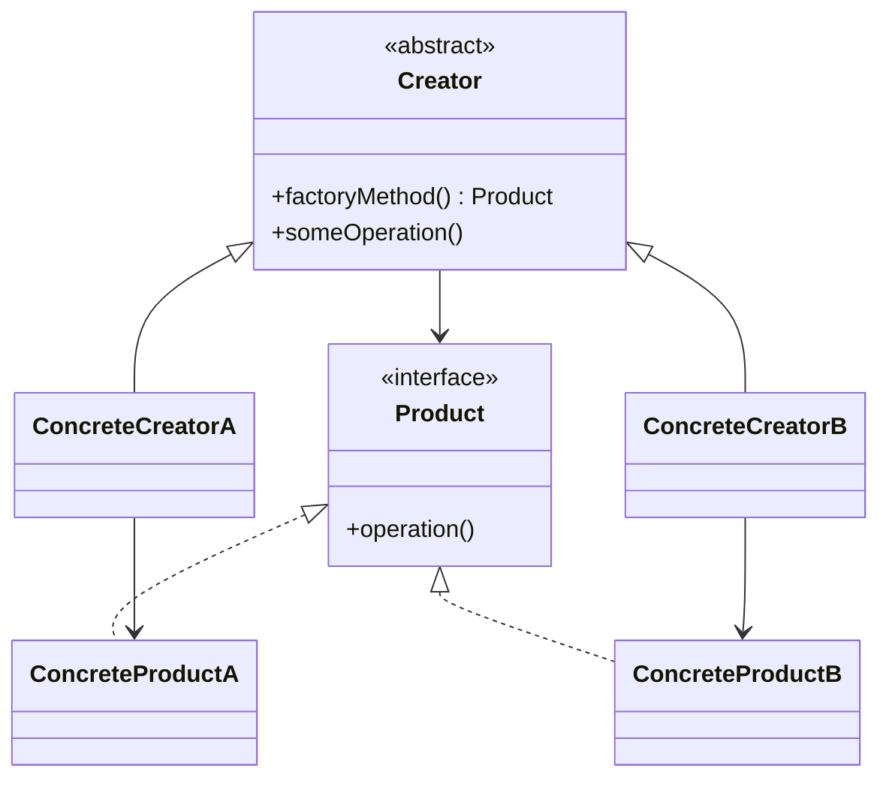

# Factory Method

## Definition

The **Factory Method Pattern** is a **creational design pattern** that defines an interface (or abstract method) for creating objects but lets **subclasses decide which concrete class to instantiate**.

Instead of directly creating objects using `new`, object creation is delegated to specialized factory subclasses.

The primary goal is to **decouple object creation from object usage**.

---

## Problem It Solves

Suppose an application needs to create different types of objects depending on context.

Without Factory Method:

- Client code depends on concrete classes.
- Adding new object types requires modifying existing code.
- Large `if-else` or `switch` statements appear throughout the application.

Example:

```java
if (os.equals("Windows")) {
    button = new WindowsButton();
} else {
    button = new MacButton();
}
```

As more object types are introduced, maintenance becomes difficult.

Factory Method moves the creation responsibility into subclasses.

---

## Core Idea

1. Define an abstract creator class with a factory method.
2. Subclasses override the factory method.
3. Each subclass creates its own concrete product.
4. Client code works with the creator and product abstractions.

The creator doesn't know the exact class being instantiated.

---

## Real-Life Analogy

Imagine a **logistics company**.

A customer asks for transportation.

- A **Road Logistics** company delivers using a **Truck**.
- A **Sea Logistics** company delivers using a **Ship**.
- An **Air Logistics** company delivers using an **Airplane**.

The customer requests delivery from the logistics company, not from the vehicle directly.

Each logistics company decides which transport to create.

---

## UML Structure



Flow:

```text
        Client
           │
           ▼
     Concrete Creator
           │
           ▼
    factoryMethod()
           │
      ┌────┴─────┐
      ▼          ▼
 Product A   Product B
```

---

## Java Example

```java
interface Button {
    void render();
}

class WindowsButton implements Button {

    @Override
    public void render() {
        System.out.println("Windows Button");
    }
}

class MacButton implements Button {

    @Override
    public void render() {
        System.out.println("Mac Button");
    }
}

abstract class Dialog {

    public abstract Button createButton();

    public void renderWindow() {
        Button button = createButton();
        button.render();
    }
}

class WindowsDialog extends Dialog {

    @Override
    public Button createButton() {
        return new WindowsButton();
    }
}

class MacDialog extends Dialog {

    @Override
    public Button createButton() {
        return new MacButton();
    }
}

public class Main {

    public static void main(String[] args) {

        Dialog dialog = new WindowsDialog();

        dialog.renderWindow();
    }
}
```

---

## JavaScript / TypeScript Example

```ts
interface Button {
  render(): void;
}

class WindowsButton implements Button {
  render(): void {
    console.log("Windows Button");
  }
}

class MacButton implements Button {
  render(): void {
    console.log("Mac Button");
  }
}

abstract class Dialog {
  abstract createButton(): Button;

  renderWindow() {
    const button = this.createButton();
    button.render();
  }
}

class WindowsDialog extends Dialog {
  createButton(): Button {
    return new WindowsButton();
  }
}

class MacDialog extends Dialog {
  createButton(): Button {
    return new MacButton();
  }
}

const dialog = new WindowsDialog();

dialog.renderWindow();
```

---

## Real Software Example

Factory Method is widely used in:

- Cross-platform UI frameworks (Windows, macOS, Linux widgets)
- Database driver creation
- Logging framework implementations
- Document editors creating different document types
- Game engines spawning different entities

Example:

```text
Application
      │
      ▼
Dialog (abstract)
      │
 ┌────┴─────┐
 ▼          ▼
Windows   Mac
Dialog    Dialog
 │           │
 ▼           ▼
Windows    Mac
Button     Button
```

---

## Advantages

- Reduces coupling between client code and concrete classes.
- Follows the Open/Closed Principle.
- Supports easy extension with new product types.
- Centralizes object creation logic.
- Encourages programming against interfaces.
- Improves maintainability.

---

## Disadvantages

- Introduces additional classes.
- Can make the design more complex.
- Small projects may become unnecessarily over-engineered.
- Requires subclassing even for simple variations.

---

## When to Use

Use Factory Method when:

- The exact object type is determined at runtime.
- You want subclasses to control object creation.
- You need to follow the Open/Closed Principle.
- Multiple implementations share a common interface.
- Framework users should extend creation behavior.

Examples:

- UI toolkits
- Plugin systems
- Cross-platform applications
- Document editors

---

## When Not to Use

Avoid Factory Method when:

- Object creation is simple and unlikely to change.
- Only one implementation exists.
- A Simple Factory is sufficient.
- The extra abstraction adds unnecessary complexity.

---

## Interview Questions

### 1. What is the Factory Method Pattern?

It is a creational pattern that defines a factory interface while allowing subclasses to decide which concrete object to create.

---

### 2. What problem does it solve?

It removes direct dependencies on concrete classes and delegates object creation to subclasses.

---

### 3. How is it different from Simple Factory?

**Simple Factory**

- Usually one factory class.
- Uses `if-else` or `switch`.
- Centralized creation logic.

**Factory Method**

- Uses inheritance.
- Subclasses override the factory method.
- New product types can often be added without modifying existing creators.

---

### 4. Which SOLID principle does it support?

Primarily the **Open/Closed Principle** by allowing extension through new subclasses instead of modifying existing code.

It also promotes the **Dependency Inversion Principle** by relying on abstractions.

---

### 5. What is the "factory method"?

It is the abstract or overridable method responsible for creating product objects.

Example:

```java
public abstract Button createButton();
```

---

### 6. What are common real-world examples?

- GUI frameworks
- Database drivers
- Logging libraries
- Document creation systems
- Plugin architectures

---

### 7. What is the biggest advantage?

New product types can be introduced by creating new subclasses without changing existing client code.

---

## Memory Trick

> **"The parent defines the factory; the child decides what to build."**

Think of a **delivery company franchise**:

- Headquarters defines **"Deliver Package()"**.
- Each local branch chooses whether to use a **Truck**, **Ship**, or **Plane**.

The process stays the same, but each branch creates its own implementation.

---

## Implementation Checklist

- ✅ Define a common product interface or abstract class.
- ✅ Create concrete product implementations.
- ✅ Define an abstract creator with a factory method.
- ✅ Let subclasses override the factory method.
- ✅ Client depends only on creator and product abstractions.
- ✅ Avoid direct instantiation of concrete products in client code.
- ✅ Add new product types by creating new creator subclasses rather than modifying existing ones.
