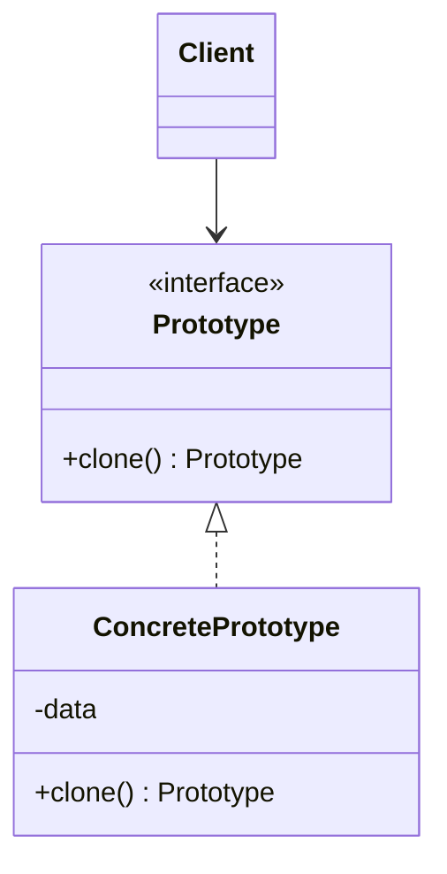

# Prototype

## Definition

The **Prototype Pattern** is a **creational design pattern** that creates new objects by **copying (cloning) an existing object**, called the prototype, instead of creating a new instance from scratch.

It is useful when object creation is expensive or complex and existing objects can be duplicated efficiently.

---

## Problem It Solves

Sometimes creating an object involves:

- Expensive database queries.
- Complex initialization logic.
- Loading configuration files.
- Building nested object structures.
- Performing heavy computations.

Creating such objects repeatedly wastes time and resources.

Instead of rebuilding the object every time, the Prototype pattern allows us to **clone an existing object** and modify only the necessary parts.

---

## Core Idea

1. Create an initial object (the prototype).
2. When another similar object is needed, clone the prototype.
3. Modify the cloned object if necessary.
4. Avoid repeating expensive initialization logic.

The focus is on **copying existing objects rather than constructing new ones**.

---

## Real-Life Analogy

Imagine making multiple copies of an important document.

Instead of rewriting the entire document from scratch every time, you simply use a **photocopier** to create identical copies.

The original document acts as the **prototype**, and each photocopy is a cloned object.

---

## UML Structure



Flow:

```text
      Existing Object
            │
            ▼
        clone()
            │
            ▼
     New Copied Object
            │
            ▼
    Modify if Necessary
```

---

## Java Example

```java
class Car implements Cloneable {

    private String model;

    public Car(String model) {
        this.model = model;
    }

    public void setModel(String model) {
        this.model = model;
    }

    public void display() {
        System.out.println(model);
    }

    @Override
    protected Car clone() {

        try {
            return (Car) super.clone();
        } catch (CloneNotSupportedException e) {
            throw new RuntimeException(e);
        }
    }
}

public class Main {

    public static void main(String[] args) {

        Car original = new Car("Tesla Model S");

        Car copy = original.clone();

        copy.setModel("Tesla Model X");

        original.display();
        copy.display();
    }
}
```

---

## JavaScript / TypeScript Example

```ts
class Car {
  constructor(public model: string) {}

  clone(): Car {
    return new Car(this.model);
  }
}

const original = new Car("Tesla Model S");

const copy = original.clone();

copy.model = "Tesla Model X";

console.log(original.model); // Tesla Model S
console.log(copy.model); // Tesla Model X
```

---

## Real Software Example

Common real-world uses include:

- Cloning game characters or enemies.
- Copying graphical objects in drawing applications.
- Duplicating UI components.
- Creating document templates.
- Copying configuration objects.
- Object duplication in design tools like Figma or Photoshop.

Example:

```text
Original Template
        │
        ▼
      clone()
        │
        ▼
 Customized Copy
```

---

## Advantages

- Avoids expensive object creation.
- Reduces repeated initialization logic.
- Improves performance when object construction is costly.
- Simplifies creation of similar objects.
- Can create objects at runtime without knowing their concrete class.
- Supports flexible object duplication.

---

## Disadvantages

- Cloning complex object graphs can be difficult.
- Deep copying may require additional implementation.
- Shallow copies can lead to shared mutable state.
- Every class must properly implement cloning logic.
- Maintenance becomes harder for nested objects.

---

## When to Use

Use Prototype when:

- Object creation is expensive.
- Many similar objects are required.
- Creating objects involves heavy initialization.
- You want to duplicate runtime-generated objects.
- You need configurable templates.

Examples:

- Game entities
- Graphic editors
- Document templates
- UI components

---

## When Not to Use

Avoid Prototype when:

- Objects are simple and inexpensive to create.
- Deep cloning is difficult or error-prone.
- Constructors already provide straightforward initialization.
- Shared references could cause unexpected side effects.

---

## Interview Questions

### 1. What is the Prototype Design Pattern?

A creational pattern that creates new objects by cloning existing ones instead of constructing them from scratch.

---

### 2. What problem does Prototype solve?

It reduces the cost and complexity of repeatedly creating expensive or highly configured objects.

---

### 3. What is shallow copy?

A shallow copy duplicates the object itself but shares references to nested objects.

Example:

```text
Object A
   │
   ├── Child ──────────┐
                       │
Object B (clone) ──────┘
```

Both objects reference the same child.

---

### 4. What is deep copy?

A deep copy duplicates both the object and all nested objects recursively.

```text
Object A
   │
   └── Child A

Object B
   │
   └── Child B
```

No references are shared.

---

### 5. What are common applications?

- Game object cloning
- Graphic editors
- Document templates
- UI components
- Configuration objects

---

### 6. Why can Prototype improve performance?

Because copying an existing object is often much faster than rebuilding a complex object from scratch.

---

### 7. What is the biggest challenge when implementing Prototype?

Correctly handling deep copies and avoiding unintended sharing of mutable objects.

---

## Memory Trick

> **"Don't build it again—copy it."**

Think of a **photocopier**:

- Original document = Prototype.
- Press **Copy** = `clone()`.
- New document = New object with the same content.

---

## Implementation Checklist

- ✅ Identify objects that are expensive to create.
- ✅ Define a `clone()` method or cloning interface.
- ✅ Implement shallow or deep copy as needed.
- ✅ Ensure nested objects are cloned correctly when required.
- ✅ Allow clients to create objects by cloning prototypes.
- ✅ Avoid unnecessary reconstruction logic.
- ✅ Test cloned objects for independence from the original.
