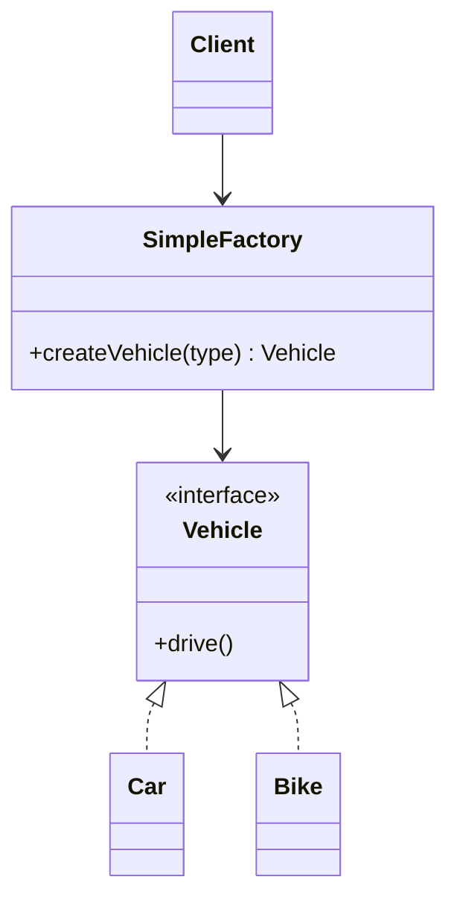

# Simple Factory

## Definition

The **Simple Factory Pattern** is a **creational design pattern** (though not one of the official GoF patterns) that centralizes object creation in a single factory class or method. Instead of creating objects directly using `new`, clients ask the factory to create the appropriate object based on input.

The main goal is to **encapsulate object creation logic** and reduce coupling between the client and concrete classes.

---

## Problem It Solves

Suppose an application needs to create different types of objects depending on user input or configuration.

Without a Simple Factory:

- Client code contains multiple `if-else` or `switch` statements.
- Object creation logic is duplicated across the application.
- Adding new object types requires modifying many places.

Example:

```java
if (type.equals("Car")) {
    vehicle = new Car();
} else if (type.equals("Bike")) {
    vehicle = new Bike();
} else if (type.equals("Truck")) {
    vehicle = new Truck();
}
```

As the number of object types grows, the code becomes difficult to maintain.

A Simple Factory moves this responsibility into one centralized location.

---

## Core Idea

Instead of allowing clients to instantiate objects directly:

1. The client requests an object from the factory.
2. The factory decides which concrete class to instantiate.
3. The factory returns the created object.
4. The client works only with the common interface or parent class.

---

## Real-Life Analogy

Imagine ordering a drink at a **coffee shop**.

You tell the cashier:

> "I want a Cappuccino."

You don't prepare the coffee yourself.

The barista (factory):

- Receives the request.
- Chooses the correct recipe.
- Makes the drink.
- Hands it to you.

You simply consume the product without knowing how it was created.

---

## UML Structure



Flow:

```text
      Client
         │
         ▼
 SimpleFactory.create(type)
         │
         ▼
  +-------------------+
  |   Decide Type     |
  +-------------------+
      │          │
      ▼          ▼
    Car        Bike
      │          │
      └────┬─────┘
           ▼
      Return Object
```

---

## Java Example

```java
interface Vehicle {
    void drive();
}

class Car implements Vehicle {
    public void drive() {
        System.out.println("Driving Car");
    }
}

class Bike implements Vehicle {
    public void drive() {
        System.out.println("Driving Bike");
    }
}

class VehicleFactory {

    public static Vehicle createVehicle(String type) {

        if (type.equalsIgnoreCase("Car")) {
            return new Car();
        }

        if (type.equalsIgnoreCase("Bike")) {
            return new Bike();
        }

        throw new IllegalArgumentException("Invalid vehicle type");
    }
}

public class Main {

    public static void main(String[] args) {

        Vehicle vehicle = VehicleFactory.createVehicle("Car");

        vehicle.drive();
    }
}
```

---

## JavaScript / TypeScript Example

```ts
interface Vehicle {
  drive(): void;
}

class Car implements Vehicle {
  drive(): void {
    console.log("Driving Car");
  }
}

class Bike implements Vehicle {
  drive(): void {
    console.log("Driving Bike");
  }
}

class VehicleFactory {
  static createVehicle(type: string): Vehicle {
    switch (type.toLowerCase()) {
      case "car":
        return new Car();

      case "bike":
        return new Bike();

      default:
        throw new Error("Invalid vehicle type");
    }
  }
}

const vehicle = VehicleFactory.createVehicle("car");

vehicle.drive();
```

---

## Real Software Example

Simple Factory is commonly used in:

- Parser selection based on file type (`JSON`, `XML`, `CSV`)
- Database driver creation
- Notification service creation (`Email`, `SMS`, `Push`)
- UI widget creation
- Payment processor selection

Example:

```text
Input: "PDF"
        │
        ▼
 DocumentFactory
        │
        ▼
  PdfDocument object
```

---

## Advantages

- Centralizes object creation logic.
- Reduces duplication.
- Hides implementation details from clients.
- Makes client code cleaner.
- Easier to change object creation in one place.
- Encourages programming against interfaces.

---

## Disadvantages

- Factory may become large as more products are added.
- Violates the Open/Closed Principle because adding a new product usually requires modifying the factory.
- Can become a maintenance bottleneck.
- Less flexible than Factory Method or Abstract Factory.

---

## When to Use

Use Simple Factory when:

- Object creation logic is straightforward.
- Multiple object types share a common interface.
- You want to remove `new` calls from client code.
- Creation depends on runtime input.

Examples:

- File parsers
- Notification services
- Payment handlers
- Vehicle creators

---

## When Not to Use

Avoid Simple Factory when:

- New product types are added frequently.
- You want subclasses to control object creation.
- You need families of related objects.
- The factory grows into a large `switch` statement.

In such cases, prefer:

- Factory Method
- Abstract Factory

---

## Interview Questions

### 1. What is the Simple Factory Pattern?

A centralized factory that creates objects based on input instead of allowing clients to instantiate them directly.

---

### 2. Is Simple Factory an official GoF design pattern?

No.

It is a widely used design technique but is **not included in the original Gang of Four design patterns**.

---

### 3. What problem does it solve?

It hides object creation logic and reduces coupling between client code and concrete implementations.

---

### 4. How is it different from Factory Method?

Simple Factory:
- Usually one factory class.
- Uses `if-else` or `switch`.
- Centralized creation logic.

Factory Method:
- Uses inheritance.
- Subclasses decide which object to create.
- Follows the Open/Closed Principle better.

---

### 5. What principle does it partially support?

It supports **Encapsulation** by hiding creation logic but often violates the **Open/Closed Principle** because the factory must be modified to add new products.

---

### 6. What are common examples?

- Notification factories
- Payment gateways
- File parsers
- Database connectors
- Shape creators

---

### 7. What is the biggest disadvantage?

The factory can become a large conditional block that must be modified whenever new product types are introduced.

---

## Memory Trick

> **"One factory, many products."**

Think of a **restaurant cashier**.

You place an order:

- Pizza
- Burger
- Pasta

The kitchen (factory) decides what to prepare and gives you the finished item.

You don't cook it yourself.

---

## Implementation Checklist

- ✅ Create a common interface or abstract class.
- ✅ Implement multiple concrete products.
- ✅ Create a factory class or static factory method.
- ✅ Factory chooses the correct object based on input.
- ✅ Client interacts only with the interface.
- ✅ Keep object creation logic centralized.
- ✅ Consider Factory Method if the factory becomes too complex.
