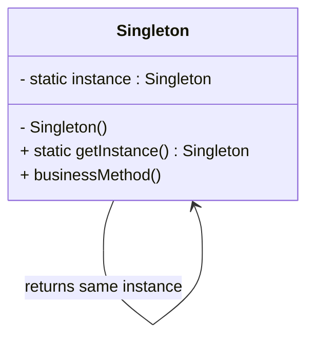

# Singleton

## Definition

The **Singleton Pattern** is a **creational design pattern** that ensures a class has **only one instance** throughout the application's lifecycle and provides a **global access point** to that instance.

It is commonly used for objects that manage shared resources, configurations, logging, or system-wide services.

---

## Problem It Solves

Sometimes an application should have **exactly one object** responsible for a particular task.

Without Singleton:

- Multiple instances may create inconsistent state.
- Resources may be wasted by creating duplicate objects.
- Different parts of the application may accidentally use different instances.

Example:
- Multiple database connection managers.
- Multiple configuration managers.
- Multiple logging services writing independently.

Singleton guarantees that every component accesses the **same shared object**.

---

## Core Idea

1. Make the constructor private so no external class can create objects.
2. Store a single static instance inside the class.
3. Provide a public static method (commonly `getInstance()`) that returns that instance.
4. Create the object only once (either eagerly or lazily).

---

## Real-Life Analogy

Imagine the **President of a country**.

There can only be **one official President** at a time. Whenever someone needs to communicate with the President, they interact with the **same person**, not a newly created one.

Similarly, a Singleton class guarantees there is only one instance available globally.

---

## UML Structure



Flow:

```text
           getInstance()
                 │
                 ▼
        Is instance created?
           /            \
         No              Yes
         │                │
         ▼                ▼
 Create Singleton     Return existing
     instance            instance
         │
         └──────────────► Return
```

---

## Java Example

```java
class Singleton {

    private static Singleton instance;

    private Singleton() {
        // private constructor
    }

    public static Singleton getInstance() {

        if (instance == null) {
            instance = new Singleton();
        }

        return instance;
    }

    public void showMessage() {
        System.out.println("Singleton instance");
    }
}

public class Main {

    public static void main(String[] args) {

        Singleton s1 = Singleton.getInstance();
        Singleton s2 = Singleton.getInstance();

        s1.showMessage();

        System.out.println(s1 == s2); // true
    }
}
```

> **Note:** The above lazy implementation is **not thread-safe**.

A thread-safe version:

```java
class Singleton {

    private static final Singleton INSTANCE = new Singleton();

    private Singleton() {}

    public static Singleton getInstance() {
        return INSTANCE;
    }
}
```

---

## JavaScript / TypeScript Example

```ts
class Singleton {
  private static instance: Singleton;

  private constructor() {}

  static getInstance(): Singleton {
    if (!Singleton.instance) {
      Singleton.instance = new Singleton();
    }

    return Singleton.instance;
  }

  sayHello() {
    console.log("Singleton instance");
  }
}

const obj1 = Singleton.getInstance();
const obj2 = Singleton.getInstance();

obj1.sayHello();

console.log(obj1 === obj2); // true
```

---

## Real Software Example

Common real-world uses include:

- Configuration Manager
- Logger
- Cache Manager
- Printer Spooler
- Database Connection Pool Manager
- Application-wide Settings Manager

For example, many frameworks expose a single logging service that is shared throughout the application instead of creating a new logger object every time.

---

## Advantages

- Ensures only one instance exists.
- Provides a global access point.
- Prevents duplicate resource allocation.
- Saves memory for shared objects.
- Centralizes configuration and state management.
- Lazy initialization can delay object creation until needed.

---

## Disadvantages

- Introduces global state, making testing harder.
- Can create hidden dependencies between classes.
- Violates the Single Responsibility Principle if overused.
- Requires special handling for thread safety.
- Makes dependency injection more difficult.
- Can become an anti-pattern in large systems.

---

## When to Use

Use Singleton when:

- Exactly one instance should exist.
- Multiple modules need access to the same shared object.
- Managing shared resources like:
  - Logger
  - Configuration
  - Cache
  - Connection manager
  - Application settings

---

## When Not to Use

Avoid Singleton when:

- Multiple independent instances may be required in the future.
- Dependency Injection frameworks can manage object lifecycles.
- The object maintains mutable global state that complicates testing.
- Better modularity and loose coupling are desired.

---

## Interview Questions

### 1. What is the Singleton Design Pattern?

A creational pattern that ensures only one instance of a class exists and provides global access to it.

---

### 2. How is Singleton implemented?

By:
- Making the constructor private.
- Holding a static instance.
- Providing a static `getInstance()` method.

---

### 3. Why is thread safety important?

Without synchronization, multiple threads may create multiple instances simultaneously.

---

### 4. What is eager initialization?

The Singleton object is created when the class is loaded.

Example:

```java
private static final Singleton INSTANCE = new Singleton();
```

---

### 5. What is lazy initialization?

The object is created only when first requested.

```java
if (instance == null) {
    instance = new Singleton();
}
```

---

### 6. Why is Singleton sometimes considered an anti-pattern?

Because it introduces global state, tight coupling, and makes unit testing more difficult.

---

### 7. Can Singleton be broken?

Yes.

Using:
- Reflection
- Serialization
- Improper cloning

unless additional safeguards are implemented.

---

### 8. What are common real-world examples?

- Logger
- Configuration manager
- Cache manager
- Database manager
- Runtime settings

---

## Memory Trick

> **"One class → One object → Everyone shares it."**

Think of a country's **President**:
- Only one official instance exists.
- Everyone communicates with the same person.
- Nobody creates another President.

---

## Implementation Checklist

- ✅ Constructor is `private`.
- ✅ Class stores a static instance.
- ✅ Public `getInstance()` method exists.
- ✅ Instance is created only once.
- ✅ Thread safety is considered if needed.
- ✅ Cloning and serialization are handled if required.
- ✅ Used only when a single shared instance is truly necessary.
