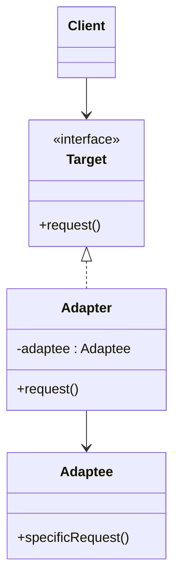

# Adapter

## Definition

The **Adapter Pattern** is a **structural design pattern** that allows **objects with incompatible interfaces to work together** by converting one interface into another that the client expects.

It acts as a **bridge** between an existing class (the adaptee) and the desired interface (the target) without modifying the original code.

---

## Problem It Solves

Suppose your application expects an object implementing:

```java
interface MediaPlayer {
    void play(String file);
}
```

But you want to use an existing library that provides:

```java
class LegacyPlayer {
    void playFile(String file);
}
```

The interfaces are incompatible.

Without Adapter:

- Client code cannot directly use `LegacyPlayer`.
- Modifying third-party code may not be possible.
- Rewriting existing code is expensive.

The Adapter converts one interface into another so they work seamlessly.

---

## Core Idea

1. Define the interface expected by the client (Target).
2. Keep the existing incompatible class (Adaptee) unchanged.
3. Create an Adapter that implements the Target interface.
4. Internally, the Adapter delegates calls to the Adaptee.

The client only interacts with the Target interface.

---

## Real-Life Analogy

Imagine traveling from **India to the United States**.

Your laptop charger has an **Indian plug**, but the US wall socket uses a different shape.

Instead of replacing the charger or the socket, you use a **travel adapter** that converts one interface into another.

```text
Indian Plug
      │
      ▼
Travel Adapter
      │
      ▼
US Socket
```

The charger works without modification.

---

## UML Structure



Flow:

```text
      Client
         │
         ▼
     Target Interface
         │
         ▼
      Adapter
         │
         ▼
     Legacy Class
```

---

## Java Example

```java
interface MediaPlayer {
    void play(String file);
}

class LegacyPlayer {

    public void playFile(String file) {
        System.out.println("Playing: " + file);
    }
}

class MediaAdapter implements MediaPlayer {

    private LegacyPlayer legacyPlayer;

    public MediaAdapter(LegacyPlayer legacyPlayer) {
        this.legacyPlayer = legacyPlayer;
    }

    @Override
    public void play(String file) {
        legacyPlayer.playFile(file);
    }
}

public class Main {

    public static void main(String[] args) {

        MediaPlayer player = new MediaAdapter(new LegacyPlayer());

        player.play("song.mp3");
    }
}
```

---

## JavaScript / TypeScript Example

```ts
interface MediaPlayer {
  play(file: string): void;
}

class LegacyPlayer {
  playFile(file: string): void {
    console.log(`Playing: ${file}`);
  }
}

class MediaAdapter implements MediaPlayer {
  constructor(private legacyPlayer: LegacyPlayer) {}

  play(file: string): void {
    this.legacyPlayer.playFile(file);
  }
}

const player: MediaPlayer = new MediaAdapter(new LegacyPlayer());

player.play("song.mp3");
```

---

## Real Software Example

Adapter is commonly used in:

- Payment gateway integrations
- Database drivers
- Third-party API wrappers
- Legacy system integration
- Logging framework adapters
- XML ↔ JSON converters

Examples:

- `InputStreamReader` in Java adapts byte streams to character streams.
- `Arrays.asList()` adapts arrays to the `List` interface.
- Spring adapters for integrating legacy APIs.

Example flow:

```text
Application
      │
      ▼
 Payment Adapter
      │
      ▼
 Stripe SDK / PayPal SDK
```

---

## Advantages

- Reuses existing classes without modification.
- Promotes code reuse.
- Improves compatibility between incompatible interfaces.
- Reduces coupling between client and implementation.
- Simplifies integration with third-party libraries.
- Supports the Open/Closed Principle.

---

## Disadvantages

- Introduces additional classes.
- Can make the design more complex.
- Too many adapters may increase maintenance overhead.
- May hide underlying incompatibilities.

---

## When to Use

Use Adapter when:

- Integrating legacy systems.
- Using third-party libraries with incompatible APIs.
- Wrapping external SDKs.
- Migrating from old implementations to new ones.
- Reusing existing code with different interfaces.

Examples:

- Payment providers
- Logging libraries
- Cloud SDKs
- Database connectors

---

## When Not to Use

Avoid Adapter when:

- Interfaces are already compatible.
- You can modify the original class safely.
- The additional abstraction adds unnecessary complexity.
- A redesign is simpler than adaptation.

---

## Interview Questions

### 1. What is the Adapter Pattern?

It is a structural pattern that allows incompatible interfaces to work together by introducing an intermediate adapter.

---

### 2. What problem does Adapter solve?

It enables existing classes with incompatible interfaces to be used without modifying their source code.

---

### 3. What are the main participants in Adapter?

- **Target** – Interface expected by the client.
- **Adaptee** – Existing incompatible class.
- **Adapter** – Converts Target calls into Adaptee calls.
- **Client** – Uses the Target interface.

---

### 4. How is Adapter different from Decorator?

**Adapter**

- Changes an interface.
- Makes incompatible classes compatible.

**Decorator**

- Preserves the interface.
- Adds new behavior dynamically.

---

### 5. How is Adapter different from Facade?

**Adapter**

- Converts one interface into another.

**Facade**

- Provides a simplified interface over a complex subsystem.

---

### 6. Can Adapter work with third-party libraries?

Yes. It is one of the most common ways to integrate external libraries without changing client code.

---

### 7. What are common real-world examples?

- Travel plug adapters
- Payment gateway wrappers
- Database driver adapters
- Legacy API integrations
- `InputStreamReader` in Java

---

## Memory Trick

> **"Adapter changes the plug, not the appliance."**

Think of a **travel plug adapter**:

- Laptop charger = Existing class (Adaptee)
- Wall socket = Client expectation (Target)
- Travel adapter = Adapter

The charger works without being redesigned.

---

## Implementation Checklist

- ✅ Identify the interface expected by the client (Target).
- ✅ Keep the existing incompatible class (Adaptee) unchanged.
- ✅ Create an Adapter implementing the Target interface.
- ✅ Delegate calls from the Adapter to the Adaptee.
- ✅ Ensure client code depends only on the Target interface.
- ✅ Avoid modifying third-party or legacy code.
- ✅ Use composition inside the Adapter whenever possible.
