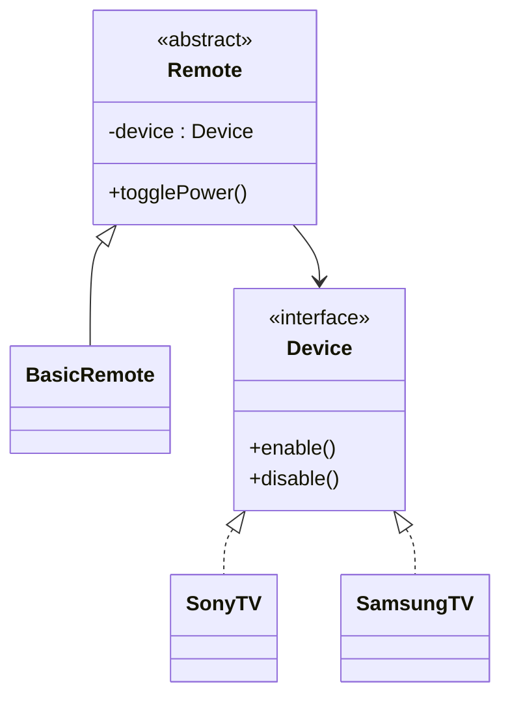

# Bridge

## Definition

The **Bridge Pattern** is a **structural design pattern** that **separates an abstraction from its implementation**, allowing both to evolve independently.

Instead of tightly coupling an abstraction with a specific implementation through inheritance, the Bridge pattern uses **composition** to connect them.

Its primary goal is to **avoid an explosion of subclasses** when both abstractions and implementations can vary independently.

---

## Problem It Solves

Suppose you have different types of remote controls and different brands of TVs.

Without Bridge:

```text
BasicSonyRemote
AdvancedSonyRemote
BasicSamsungRemote
AdvancedSamsungRemote
BasicLGRemote
AdvancedLGRemote
...
```

As more remote types or TV brands are added, the number of classes grows rapidly.

This is known as the **class explosion problem**.

The Bridge pattern separates:

- **Abstraction** → Remote Control
- **Implementation** → TV

so both can change independently.

---

## Core Idea

1. Define an **Abstraction** that contains a reference to an **Implementor**.
2. Define an interface for the implementation.
3. Create concrete implementations.
4. The abstraction delegates work to the implementation through composition.

Instead of inheritance:

```text
Remote
   │
   ▼
TV Interface
   │
 ┌─┴─────────┐
 ▼           ▼
SonyTV   SamsungTV
```

---

## Real-Life Analogy

Think of a **remote control** and a **television**.

A remote can control:

- Sony TV
- Samsung TV
- LG TV

Likewise, different remotes can exist:

- Basic Remote
- Smart Remote
- Voice Remote

The remote and the TV are developed independently but communicate through a common interface.

```text
Smart Remote
        │
        ▼
   TV Interface
        │
   ┌────┴─────┐
   ▼          ▼
Sony TV   Samsung TV
```

---

## UML Structure



Flow:

```text
      Client
         │
         ▼
     Remote Control
         │
         ▼
    Device Interface
         │
   ┌─────┴────────┐
   ▼              ▼
Sony TV      Samsung TV
```

---

## Java Example

```java
interface Device {

    void turnOn();

    void turnOff();
}

class TV implements Device {

    @Override
    public void turnOn() {
        System.out.println("TV ON");
    }

    @Override
    public void turnOff() {
        System.out.println("TV OFF");
    }
}

class Radio implements Device {

    @Override
    public void turnOn() {
        System.out.println("Radio ON");
    }

    @Override
    public void turnOff() {
        System.out.println("Radio OFF");
    }
}

class Remote {

    protected Device device;

    public Remote(Device device) {
        this.device = device;
    }

    public void powerOn() {
        device.turnOn();
    }

    public void powerOff() {
        device.turnOff();
    }
}

public class Main {

    public static void main(String[] args) {

        Device tv = new TV();

        Remote remote = new Remote(tv);

        remote.powerOn();
        remote.powerOff();
    }
}
```

---

## JavaScript / TypeScript Example

```ts
interface Device {
  turnOn(): void;
  turnOff(): void;
}

class TV implements Device {
  turnOn(): void {
    console.log("TV ON");
  }

  turnOff(): void {
    console.log("TV OFF");
  }
}

class Radio implements Device {
  turnOn(): void {
    console.log("Radio ON");
  }

  turnOff(): void {
    console.log("Radio OFF");
  }
}

class Remote {
  constructor(protected device: Device) {}

  powerOn() {
    this.device.turnOn();
  }

  powerOff() {
    this.device.turnOff();
  }
}

const remote = new Remote(new TV());

remote.powerOn();
remote.powerOff();
```

---

## Real Software Example

Bridge is commonly used in:

- GUI frameworks
- Device drivers
- Database abstraction layers
- Logging frameworks
- Rendering engines
- Graphics APIs

Examples:

- Java JDBC separates application logic from specific database drivers.
- ORM frameworks separate models from database implementations.
- Cross-platform UI toolkits separate widgets from platform-specific rendering.

Example:

```text
Application
      │
      ▼
Database API
      │
 ┌────┴──────────┐
 ▼               ▼
MySQL Driver   PostgreSQL Driver
```

---

## Advantages

- Separates abstraction from implementation.
- Prevents class explosion.
- Promotes composition over inheritance.
- Supports independent extension of abstractions and implementations.
- Improves maintainability.
- Follows the Open/Closed Principle.

---

## Disadvantages

- Introduces additional interfaces and classes.
- Slightly increases design complexity.
- May be unnecessary for simple hierarchies.
- Requires careful initial design.

---

## When to Use

Use Bridge when:

- Both abstraction and implementation may evolve independently.
- Multiple dimensions of variation exist.
- Inheritance would create too many subclasses.
- You want runtime switching of implementations.
- Composition is preferred over inheritance.

Examples:

- Remote controls and devices
- Shapes and rendering APIs
- Database APIs and drivers
- UI controls and platforms

---

## When Not to Use

Avoid Bridge when:

- There is only one implementation.
- Inheritance remains simple and manageable.
- No independent variation exists.
- The extra abstraction adds unnecessary complexity.

---

## Interview Questions

### 1. What is the Bridge Pattern?

A structural pattern that separates an abstraction from its implementation so both can vary independently.

---

### 2. What problem does Bridge solve?

It avoids the explosion of subclasses caused by combining multiple independent dimensions through inheritance.

---

### 3. What are the main participants?

- **Abstraction**
- **Refined Abstraction**
- **Implementor Interface**
- **Concrete Implementors**

---

### 4. How is Bridge different from Adapter?

**Bridge**

- Designed during system architecture.
- Separates abstraction from implementation.
- Focuses on extensibility.

**Adapter**

- Usually introduced later.
- Makes incompatible interfaces work together.
- Focuses on compatibility.

---

### 5. How is Bridge different from Strategy?

**Bridge**

- Separates abstraction and implementation hierarchies.

**Strategy**

- Encapsulates interchangeable algorithms.

Bridge models structural relationships, while Strategy models behavioral variations.

---

### 6. Which design principle does Bridge emphasize?

It strongly promotes:

- **Composition over Inheritance**
- **Open/Closed Principle**

---

### 7. What are common real-world examples?

- Remote controls and electronic devices
- JDBC drivers
- Graphics rendering engines
- UI frameworks
- Database abstraction layers

---

## Memory Trick

> **"Bridge connects two independent hierarchies."**

Think of a **TV remote**:

- Different remotes exist.
- Different TV brands exist.

Instead of creating one class for every combination, the remote simply **holds a reference to a TV implementation**.

---

## Implementation Checklist

- ✅ Identify two dimensions that should vary independently.
- ✅ Create an abstraction hierarchy.
- ✅ Create an implementation interface.
- ✅ Implement multiple concrete implementations.
- ✅ Connect abstraction and implementation using composition.
- ✅ Delegate work from the abstraction to the implementation.
- ✅ Prefer Bridge when inheritance would create too many subclasses.
