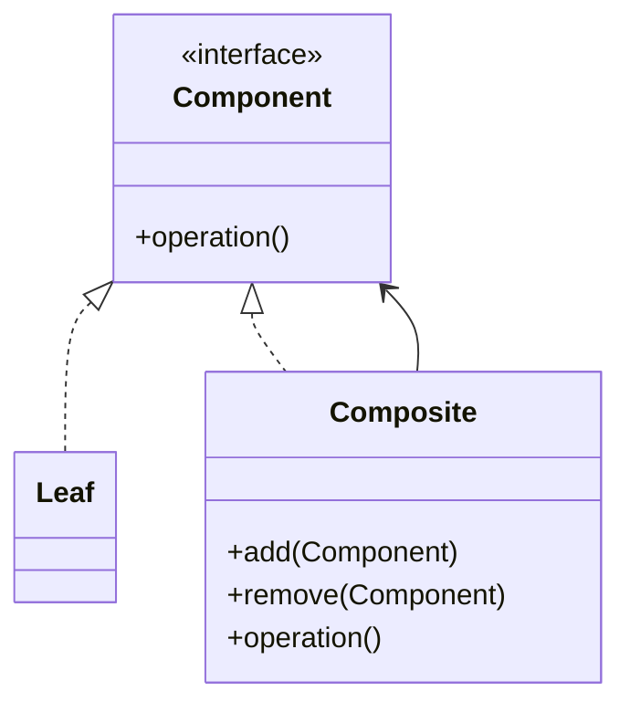

# Composite

## Definition

The **Composite Pattern** is a **structural design pattern** that allows you to **treat individual objects and groups of objects uniformly** by organizing them into a **tree structure**.

It lets clients work with both **leaf objects** and **composite objects** through the same interface.

The primary goal is to represent **part-whole hierarchies** in a simple and consistent way.

---

## Problem It Solves

Suppose you are building a file system.

It contains:

- Files
- Folders

A folder can contain:

- Files
- Other folders

Without Composite:

- Client code must distinguish between files and folders.
- Recursive operations become complicated.
- Different APIs are needed for individual and grouped objects.

The Composite pattern provides a common interface so clients can treat both uniformly.

---

## Core Idea

1. Define a common `Component` interface.
2. `Leaf` objects represent individual items.
3. `Composite` objects contain multiple components.
4. Operations on composites are delegated recursively to their children.

Everything is viewed as a `Component`.

---

## Real-Life Analogy

Think of an **organization chart**.

```text
CEO
 │
 ├── Manager A
 │      ├── Employee 1
 │      └── Employee 2
 │
 └── Manager B
        ├── Employee 3
        └── Employee 4
```

An employee is an individual object.

A manager represents a group but can still be treated as an employee in the hierarchy.

Both expose similar operations like `display()`.

---

## UML Structure



Tree representation:

```text
        Component
            │
      ┌─────┴─────┐
      ▼           ▼
    Leaf     Composite
                   │
          ┌────────┴────────┐
          ▼                 ▼
       Leaf             Composite
                             │
                             ▼
                           Leaf
```

---

## Java Example

```java
import java.util.ArrayList;
import java.util.List;

interface FileSystemComponent {

    void showDetails();
}

class File implements FileSystemComponent {

    private String name;

    public File(String name) {
        this.name = name;
    }

    @Override
    public void showDetails() {
        System.out.println(name);
    }
}

class Folder implements FileSystemComponent {

    private String name;
    private List<FileSystemComponent> children = new ArrayList<>();

    public Folder(String name) {
        this.name = name;
    }

    public void add(FileSystemComponent component) {
        children.add(component);
    }

    @Override
    public void showDetails() {

        System.out.println("Folder: " + name);

        for (FileSystemComponent child : children) {
            child.showDetails();
        }
    }
}

public class Main {

    public static void main(String[] args) {

        File file1 = new File("resume.pdf");
        File file2 = new File("photo.png");

        Folder documents = new Folder("Documents");

        documents.add(file1);
        documents.add(file2);

        documents.showDetails();
    }
}
```

---

## JavaScript / TypeScript Example

```ts
interface FileSystemComponent {
  showDetails(): void;
}

class File implements FileSystemComponent {
  constructor(private name: string) {}

  showDetails(): void {
    console.log(this.name);
  }
}

class Folder implements FileSystemComponent {
  private children: FileSystemComponent[] = [];

  constructor(private name: string) {}

  add(component: FileSystemComponent) {
    this.children.push(component);
  }

  showDetails(): void {
    console.log(`Folder: ${this.name}`);

    for (const child of this.children) {
      child.showDetails();
    }
  }
}

const docs = new Folder("Documents");

docs.add(new File("resume.pdf"));
docs.add(new File("photo.png"));

docs.showDetails();
```

---

## Real Software Example

Composite is commonly used in:

- File systems
- Organization charts
- HTML/XML DOM trees
- GUI component hierarchies
- Menu systems
- Scene graphs in game engines

Example:

```text
HTML
 │
 ├── Head
 │
 └── Body
      │
      ├── Div
      │     ├── Paragraph
      │     └── Image
      │
      └── Footer
```

Each element is treated as a node in the same hierarchy.

---

## Advantages

- Treats individual objects and groups uniformly.
- Simplifies recursive operations.
- Makes tree structures easy to model.
- Promotes code reuse.
- Supports the Open/Closed Principle.
- Simplifies client code.

---

## Disadvantages

- Can make designs overly general.
- Difficult to restrict what can be added to composites.
- Sometimes impossible to enforce meaningful relationships.
- Recursive traversal may impact performance for very large trees.

---

## When to Use

Use Composite when:

- You need to model hierarchical structures.
- Clients should treat single objects and groups identically.
- Recursive operations are common.
- The domain naturally forms a tree.

Examples:

- File systems
- Company hierarchies
- HTML DOM
- Menus
- Graphics scene graphs

---

## When Not to Use

Avoid Composite when:

- Objects do not form a tree.
- Individual and grouped objects require fundamentally different APIs.
- The hierarchy is shallow and unlikely to grow.
- Simpler data structures are sufficient.

---

## Interview Questions

### 1. What is the Composite Pattern?

It is a structural pattern that represents part-whole hierarchies and allows clients to treat individual objects and object groups uniformly.

---

### 2. What problem does Composite solve?

It eliminates the need for clients to distinguish between leaf objects and collections by providing a common interface.

---

### 3. What are the main participants?

- **Component** – Common interface.
- **Leaf** – Individual object.
- **Composite** – Contains child components.
- **Client** – Uses components uniformly.

---

### 4. How is Composite different from Decorator?

**Composite**

- Represents tree structures.
- Manages parent-child relationships.

**Decorator**

- Wraps a single object.
- Adds responsibilities dynamically.

---

### 5. How is Composite different from Bridge?

**Composite**

- Models hierarchical relationships.

**Bridge**

- Separates abstraction from implementation.

---

### 6. What is a Leaf?

A leaf is an individual object with no children.

Example:

```text
Folder
 ├── File A
 └── File B

Files are leaves.
```

---

### 7. What are common real-world examples?

- Folder structures
- HTML DOM
- Employee hierarchies
- Menus
- Scene graphs

---

## Memory Trick

> **"A folder can contain files or more folders."**

Think of your computer's file explorer:

```text
Documents
 │
 ├── Resume.pdf
 ├── Notes.txt
 └── Projects
        ├── Java
        └── TypeScript
```

Files and folders are treated using the same operations like display or delete.

---

## Implementation Checklist

- ✅ Identify a tree or part-whole hierarchy.
- ✅ Create a common `Component` interface.
- ✅ Implement `Leaf` classes for individual objects.
- ✅ Implement `Composite` classes that hold child components.
- ✅ Delegate operations recursively to child components.
- ✅ Ensure clients interact only with the `Component` interface.
- ✅ Prefer Composite when uniform treatment of single objects and groups is required.
