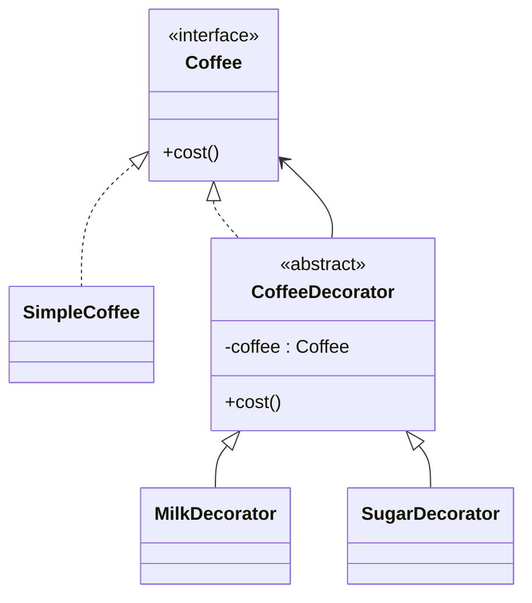

# Decorator

## Definition

The **Decorator Pattern** is a **structural design pattern** that allows you to **dynamically add new behavior or responsibilities to an object without modifying its existing code**.

It achieves this by **wrapping the original object inside another object (the decorator)** that implements the same interface.

The primary goal is to extend functionality using **composition instead of inheritance**.

---

## Problem It Solves

Suppose you have a `Coffee` class and want to support additional features:

- Milk
- Sugar
- Whipped Cream
- Caramel

Without Decorator, inheritance leads to many subclasses:

```text
Coffee
├── MilkCoffee
├── SugarCoffee
├── MilkSugarCoffee
├── CaramelCoffee
├── CaramelMilkCoffee
└── ...
```

As combinations grow, the number of subclasses explodes.

The Decorator pattern lets features be added dynamically by wrapping objects.

---

## Core Idea

1. Define a common `Component` interface.
2. Create a concrete implementation.
3. Create decorators that also implement the same interface.
4. Each decorator wraps another component and adds behavior before or after delegation.

Decorators can be stacked together.

---

## Real-Life Analogy

Imagine ordering a coffee.

Start with:

```text
Coffee
```

Add milk:

```text
Milk(Coffee)
```

Then sugar:

```text
Sugar(Milk(Coffee))
```

Then whipped cream:

```text
WhippedCream(Sugar(Milk(Coffee)))
```

Each topping wraps the previous coffee without changing the original recipe.

---

## UML Structure



Flow:

```text
      Client
         │
         ▼
   SugarDecorator
         │
         ▼
   MilkDecorator
         │
         ▼
   SimpleCoffee
```

---

## Java Example

```java
interface Coffee {

    String getDescription();

    double cost();
}

class SimpleCoffee implements Coffee {

    @Override
    public String getDescription() {
        return "Simple Coffee";
    }

    @Override
    public double cost() {
        return 100;
    }
}

abstract class CoffeeDecorator implements Coffee {

    protected Coffee coffee;

    public CoffeeDecorator(Coffee coffee) {
        this.coffee = coffee;
    }
}

class MilkDecorator extends CoffeeDecorator {

    public MilkDecorator(Coffee coffee) {
        super(coffee);
    }

    @Override
    public String getDescription() {
        return coffee.getDescription() + ", Milk";
    }

    @Override
    public double cost() {
        return coffee.cost() + 20;
    }
}

public class Main {

    public static void main(String[] args) {

        Coffee coffee = new MilkDecorator(new SimpleCoffee());

        System.out.println(coffee.getDescription());
        System.out.println(coffee.cost());
    }
}
```

---

## JavaScript / TypeScript Example

```ts
interface Coffee {
  getDescription(): string;
  cost(): number;
}

class SimpleCoffee implements Coffee {
  getDescription(): string {
    return "Simple Coffee";
  }

  cost(): number {
    return 100;
  }
}

class MilkDecorator implements Coffee {
  constructor(private coffee: Coffee) {}

  getDescription(): string {
    return `${this.coffee.getDescription()}, Milk`;
  }

  cost(): number {
    return this.coffee.cost() + 20;
  }
}

const coffee = new MilkDecorator(new SimpleCoffee());

console.log(coffee.getDescription());
console.log(coffee.cost());
```

---

## Real Software Example

Decorator is commonly used in:

- Java I/O streams
- Logging frameworks
- HTTP middleware
- UI component enhancement
- Compression and encryption pipelines
- Web request filters

Examples:

```java
BufferedInputStream
    └── FileInputStream

DataInputStream
    └── BufferedInputStream
            └── FileInputStream
```

Each wrapper adds new behavior while preserving the same interface.

Another example:

```text
HTTP Request
      │
      ▼
Authentication Middleware
      │
      ▼
Logging Middleware
      │
      ▼
Compression Middleware
      │
      ▼
Application
```

---

## Advantages

- Adds behavior dynamically at runtime.
- Avoids subclass explosion.
- Promotes composition over inheritance.
- Supports the Open/Closed Principle.
- Decorators can be combined flexibly.
- Existing classes remain unchanged.

---

## Disadvantages

- Introduces many small wrapper classes.
- Debugging nested decorators can be difficult.
- Object creation becomes more complex.
- Order of decorators may affect behavior.

---

## When to Use

Use Decorator when:

- You want to add responsibilities dynamically.
- Features should be optional and combinable.
- Inheritance would create too many subclasses.
- Existing classes should remain unchanged.

Examples:

- Coffee toppings
- Middleware pipelines
- Stream processing
- Logging
- Compression

---

## When Not to Use

Avoid Decorator when:

- Behavior is fixed and unlikely to change.
- Only one or two simple extensions exist.
- Additional wrapper objects introduce unnecessary complexity.
- Inheritance already provides a clean solution.

---

## Interview Questions

### 1. What is the Decorator Pattern?

It is a structural pattern that dynamically adds new behavior to an object by wrapping it inside another object implementing the same interface.

---

### 2. What problem does Decorator solve?

It avoids subclass explosion by allowing functionality to be added through composition rather than inheritance.

---

### 3. What are the main participants?

- **Component** – Common interface.
- **Concrete Component** – Original object.
- **Decorator** – Wrapper implementing the same interface.
- **Concrete Decorators** – Add specific responsibilities.

---

### 4. How is Decorator different from Adapter?

**Decorator**

- Preserves the interface.
- Adds new behavior.

**Adapter**

- Changes the interface.
- Makes incompatible classes work together.

---

### 5. How is Decorator different from Composite?

**Decorator**

- Wraps a single object.
- Enhances behavior.

**Composite**

- Organizes many objects into a tree structure.
- Represents part-whole hierarchies.

---

### 6. Which design principle does Decorator emphasize?

It strongly promotes:

- **Composition over Inheritance**
- **Open/Closed Principle**

---

### 7. What are common real-world examples?

- Java I/O streams
- Middleware chains
- Coffee customization
- Compression wrappers
- Encryption wrappers
- Logging decorators

---

## Memory Trick

> **"Wrap it to enhance it."**

Think of a **gift box**:

```text
Gift
  │
  ▼
Gift Wrap
  │
  ▼
Ribbon
  │
  ▼
Greeting Card
```

Each layer adds something without changing the original gift.

---

## Implementation Checklist

- ✅ Define a common `Component` interface.
- ✅ Create a concrete component.
- ✅ Create an abstract decorator implementing the same interface.
- ✅ Store a reference to the wrapped component.
- ✅ Delegate calls to the wrapped object.
- ✅ Add behavior before or after delegation.
- ✅ Allow multiple decorators to be stacked dynamically.
