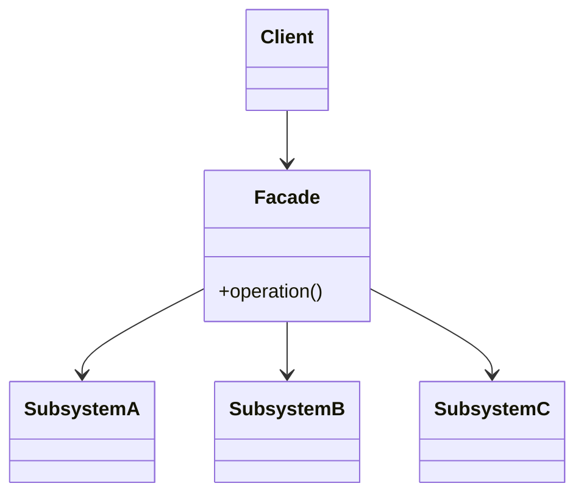

# Facade

## Definition

The **Facade Pattern** is a **structural design pattern** that provides a **simple, unified interface** to a **complex subsystem**.

Instead of interacting with multiple classes directly, clients communicate with a **Facade**, which coordinates and delegates requests to the underlying components.

The primary goal is to **reduce complexity and hide implementation details**.

---

## Problem It Solves

Suppose you want to start a home theater system.

Without a Facade, the client must interact with multiple objects:

```java
dvdPlayer.on();
projector.on();
soundSystem.on();

dvdPlayer.play(movie);
projector.setInput(dvdPlayer);
soundSystem.setVolume(20);
```

This is verbose and tightly couples the client to many subsystem classes.

A Facade simplifies the process:

```java
homeTheater.watchMovie("Inception");
```

The client only deals with one object.

---

## Core Idea

1. Keep existing subsystem classes unchanged.
2. Create a Facade class that exposes simplified operations.
3. The Facade internally coordinates multiple subsystem objects.
4. Clients depend only on the Facade instead of the entire subsystem.

The Facade acts as a convenient entry point.

---

## Real-Life Analogy

Imagine using an **ATM machine**.

Internally, the ATM communicates with:

- Bank server
- Account service
- Authentication system
- Cash dispenser
- Receipt printer

However, the user only interacts with a simple interface:

```text
Insert Card
      │
Enter PIN
      │
Withdraw Cash
```

The ATM serves as the **Facade**, hiding all internal complexity.

---

## UML Structure



Flow:

```text
        Client
           │
           ▼
        Facade
           │
   ┌───────┼────────┐
   ▼       ▼        ▼
System A System B System C
```

---

## Java Example

```java
class CPU {

    public void start() {
        System.out.println("CPU started");
    }
}

class Memory {

    public void load() {
        System.out.println("Memory loaded");
    }
}

class HardDrive {

    public void read() {
        System.out.println("Hard drive reading");
    }
}

class ComputerFacade {

    private CPU cpu = new CPU();
    private Memory memory = new Memory();
    private HardDrive hardDrive = new HardDrive();

    public void startComputer() {

        cpu.start();
        memory.load();
        hardDrive.read();

        System.out.println("Computer started");
    }
}

public class Main {

    public static void main(String[] args) {

        ComputerFacade computer = new ComputerFacade();

        computer.startComputer();
    }
}
```

---

## JavaScript / TypeScript Example

```ts
class CPU {
  start() {
    console.log("CPU started");
  }
}

class Memory {
  load() {
    console.log("Memory loaded");
  }
}

class HardDrive {
  read() {
    console.log("Hard drive reading");
  }
}

class ComputerFacade {
  private cpu = new CPU();
  private memory = new Memory();
  private hardDrive = new HardDrive();

  startComputer() {
    this.cpu.start();
    this.memory.load();
    this.hardDrive.read();

    console.log("Computer started");
  }
}

const computer = new ComputerFacade();

computer.startComputer();
```

---

## Real Software Example

Facade is commonly used in:

- Home theater systems
- Payment processing services
- Banking APIs
- SDK wrappers
- Spring Framework utilities
- Database access layers

Examples:

```text
PaymentFacade
      │
 ┌────┼─────────────┐
 ▼    ▼             ▼
Auth Validation Payment Gateway
```

Another example:

```text
Travel Booking Facade
      │
 ┌────┼────────────┐
 ▼    ▼            ▼
Flight Hotel Car Rental
```

The client books everything through a single interface.

---

## Advantages

- Simplifies client code.
- Reduces coupling with complex subsystems.
- Hides implementation details.
- Improves readability and maintainability.
- Provides a clear entry point to a subsystem.
- Encourages layered architecture.

---

## Disadvantages

- May become a "God Object" if overloaded with responsibilities.
- Can hide useful subsystem functionality.
- Adds another abstraction layer.
- Changes to subsystem APIs may require facade updates.

---

## When to Use

Use Facade when:

- A subsystem is complex.
- Clients only need simplified operations.
- You want to reduce dependencies on many classes.
- Layered architecture is desired.
- External APIs should expose a clean interface.

Examples:

- Payment services
- Booking systems
- Home automation
- Multimedia systems
- SDK wrappers

---

## When Not to Use

Avoid Facade when:

- The subsystem is already simple.
- Clients require full control over subsystem components.
- The extra abstraction provides little benefit.
- Hiding subsystem functionality limits flexibility.

---

## Interview Questions

### 1. What is the Facade Pattern?

It is a structural pattern that provides a simplified interface to a complex subsystem.

---

### 2. What problem does Facade solve?

It hides subsystem complexity and reduces coupling by giving clients a single entry point.

---

### 3. What are the main participants?

- **Facade**
- **Subsystem Classes**
- **Client**

The client communicates only with the Facade.

---

### 4. How is Facade different from Adapter?

**Facade**

- Simplifies an existing subsystem.
- Keeps interfaces unchanged.

**Adapter**

- Converts one interface into another.
- Makes incompatible classes work together.

---

### 5. How is Facade different from Mediator?

**Facade**

- Simplifies communication between the client and a subsystem.

**Mediator**

- Coordinates communication among multiple peer objects.

---

### 6. Does Facade hide subsystem classes completely?

No.

Clients can still access subsystem classes directly if needed, but the Facade provides a simpler alternative.

---

### 7. What are common real-world examples?

- ATM machines
- Home theater controllers
- Payment gateways
- Travel booking systems
- SDK wrappers
- Banking APIs

---

## Memory Trick

> **"One door to a complex building."**

Think of a **hotel reception desk**.

Instead of contacting:

- Housekeeping
- Restaurant
- Laundry
- Concierge
- Maintenance

you simply speak to the **front desk**, which coordinates everything for you.

The reception desk is the **Facade**.

---

## Implementation Checklist

- ✅ Identify a complex subsystem with multiple classes.
- ✅ Create a Facade class exposing simple operations.
- ✅ Keep subsystem classes independent and unchanged.
- ✅ Delegate work from the Facade to subsystem components.
- ✅ Ensure clients primarily depend on the Facade.
- ✅ Avoid placing unrelated business logic inside the Facade.
- ✅ Keep the Facade focused on simplifying interactions, not replacing the subsystem.
