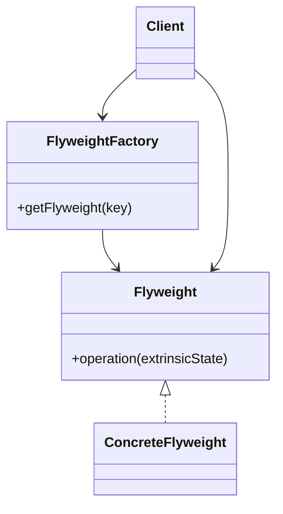

# Flyweight

## Definition

The **Flyweight Pattern** is a **structural design pattern** that **reduces memory usage by sharing common object state among multiple objects** instead of storing duplicate data in every instance.

It separates an object's state into:

- **Intrinsic State** – Shared and immutable (stored inside the flyweight).
- **Extrinsic State** – Unique per object and supplied by the client.

The primary goal is to **save memory when working with a large number of similar objects**.

---

## Problem It Solves

Imagine rendering **one million trees** in a game.

Without Flyweight:

```text
Tree
 ├── x
 ├── y
 ├── texture
 ├── color
 ├── model
 └── species
```

Every tree stores identical textures and models, wasting memory.

With Flyweight:

```text
Shared Tree Type
 ├── texture
 ├── color
 └── model

Individual Tree
 ├── x
 └── y
```

Heavy shared data is stored only once.

---

## Core Idea

1. Identify state that can be shared.
2. Store shared (intrinsic) state inside flyweight objects.
3. Keep unique (extrinsic) state outside the flyweight.
4. Reuse flyweight instances through a factory.

Multiple clients share the same flyweight object.

---

## Real-Life Analogy

Imagine a **library**.

There may be hundreds of readers using the same book.

Instead of printing a new copy for every reader:

- The **book content** is shared.
- Each reader has their own **bookmark and reading progress**.

```text
Book (shared)
      │
 ┌────┼────────┐
 ▼    ▼        ▼
User1 User2 User3

Bookmarks are individual.
```

The book is the flyweight.

---

## UML Structure



Flow:

```text
        Client
           │
           ▼
   Flyweight Factory
           │
      Existing?
      │       │
     Yes      No
      │        │
      ▼        ▼
   Return    Create &
   Shared     Store
   Object     Object
      │
      ▼
 Use with External State
```

---

## Java Example

```java
import java.util.HashMap;
import java.util.Map;

class CharacterFlyweight {

    private char symbol;

    public CharacterFlyweight(char symbol) {
        this.symbol = symbol;
    }

    public void display(int position) {
        System.out.println(symbol + " at " + position);
    }
}

class CharacterFactory {

    private static final Map<Character, CharacterFlyweight> cache =
            new HashMap<>();

    public static CharacterFlyweight getCharacter(char c) {

        cache.putIfAbsent(c, new CharacterFlyweight(c));

        return cache.get(c);
    }
}

public class Main {

    public static void main(String[] args) {

        CharacterFlyweight a1 =
                CharacterFactory.getCharacter('A');

        CharacterFlyweight a2 =
                CharacterFactory.getCharacter('A');

        System.out.println(a1 == a2); // true

        a1.display(10);
        a2.display(20);
    }
}
```

---

## JavaScript / TypeScript Example

```ts
class CharacterFlyweight {
  constructor(private symbol: string) {}

  display(position: number) {
    console.log(`${this.symbol} at ${position}`);
  }
}

class CharacterFactory {
  private static cache = new Map<string, CharacterFlyweight>();

  static getCharacter(symbol: string): CharacterFlyweight {
    if (!this.cache.has(symbol)) {
      this.cache.set(symbol, new CharacterFlyweight(symbol));
    }

    return this.cache.get(symbol)!;
  }
}

const a1 = CharacterFactory.getCharacter("A");
const a2 = CharacterFactory.getCharacter("A");

console.log(a1 === a2); // true

a1.display(10);
a2.display(20);
```

---

## Real Software Example

Flyweight is commonly used in:

- Text editors (shared character glyphs)
- Game engines (trees, bullets, particles)
- Icon libraries
- Font rendering systems
- Browser rendering engines
- Object pooling systems

Examples:

```text
Tree Factory
      │
 ┌────┴───────────┐
 ▼                ▼
Oak Type     Pine Type

Millions of trees
share only two objects.
```

Another example:

```text
Document
 │
 ├── A
 ├── A
 ├── A
 └── A

All "A" glyphs share
the same rendering data.
```

---

## Advantages

- Greatly reduces memory consumption.
- Eliminates duplicate shared data.
- Improves performance for large object collections.
- Encourages object reuse.
- Centralizes shared state management.
- Scales well for repetitive structures.

---

## Disadvantages

- Increases design complexity.
- Requires careful separation of intrinsic and extrinsic state.
- Clients must manage external state correctly.
- May not provide benefits when object sharing is minimal.

---

## When to Use

Use Flyweight when:

- The application creates a huge number of similar objects.
- Many objects share identical data.
- Memory usage is a concern.
- Shared state can be made immutable.
- Object creation becomes expensive.

Examples:

- Text rendering
- Maps
- Games
- Particle systems
- Large document editors

---

## When Not to Use

Avoid Flyweight when:

- Only a small number of objects exist.
- Objects contain mostly unique state.
- Shared state changes frequently.
- Simpler designs are preferable over optimization.

---

## Interview Questions

### 1. What is the Flyweight Pattern?

It is a structural pattern that minimizes memory usage by sharing common object state among many objects.

---

### 2. What problem does Flyweight solve?

It prevents duplication of identical data and reduces memory consumption when many similar objects exist.

---

### 3. What is intrinsic state?

Intrinsic state is:

- Shared
- Immutable
- Stored inside the flyweight

Example:

```text
Tree texture
Font glyph
Character shape
```

---

### 4. What is extrinsic state?

Extrinsic state is:

- Unique per object
- Supplied by the client
- Not stored inside the flyweight

Example:

```text
Tree position
Font size
Cursor location
```

---

### 5. What is the Flyweight Factory?

A factory responsible for:

- Creating flyweights
- Caching existing instances
- Returning shared objects when available

---

### 6. How is Flyweight different from Singleton?

**Singleton**

- Ensures exactly one instance.

**Flyweight**

- Allows many shared instances based on different keys.

Example:

```text
Singleton:
1 Logger

Flyweight:
1 TreeType(Oak)
1 TreeType(Pine)
1 TreeType(Maple)
```

---

### 7. What are common real-world examples?

- Font rendering
- Text editors
- Browser engines
- Game trees
- Particle systems
- Icon caches

---

## Memory Trick

> **"Share the heavy part, keep the unique part outside."**

Think of a **library book**:

- Book content → Shared (Flyweight)
- Reader's bookmark → Personal (Extrinsic state)

Hundreds of readers can use the same book without duplicating it.

---

## Implementation Checklist

- ✅ Identify objects created in very large numbers.
- ✅ Separate intrinsic (shared) and extrinsic (unique) state.
- ✅ Make intrinsic state immutable whenever possible.
- ✅ Create a Flyweight interface or class.
- ✅ Implement a Flyweight Factory with caching.
- ✅ Reuse existing flyweight instances instead of creating duplicates.
- ✅ Ensure clients provide extrinsic state during operations.
