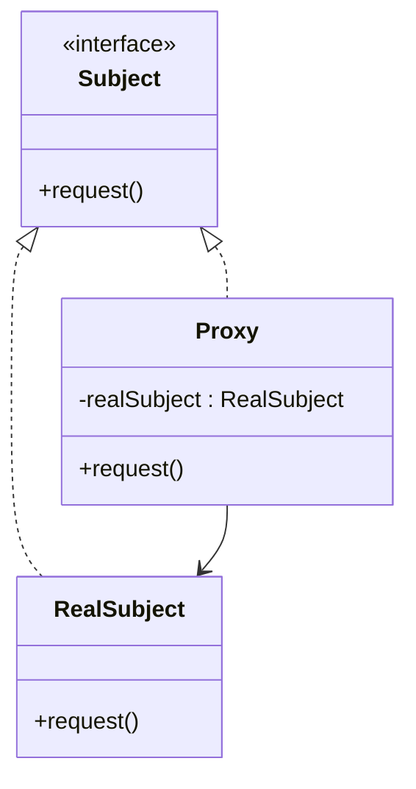

# Proxy

## Definition

The **Proxy Pattern** is a **structural design pattern** that provides a **placeholder or surrogate object** to control access to another object (called the **Real Subject**).

Instead of interacting with the real object directly, clients communicate with the **Proxy**, which can add extra behavior such as:

- Lazy initialization
- Access control
- Logging
- Caching
- Remote communication

The primary goal is to **control or enhance access to an object without changing its implementation**.

---

## Problem It Solves

Suppose loading a high-resolution image is expensive.

Without Proxy:

```java
Image image = new HighResolutionImage("photo.jpg");
image.display();
```

The image is loaded immediately, even if it is never displayed.

A Proxy delays creation until it's actually needed:

```java
Image image = new ImageProxy("photo.jpg");

image.display(); // Loads only now
```

This saves memory and startup time.

---

## Core Idea

1. Define a common interface.
2. The **Real Subject** implements the interface.
3. The **Proxy** also implements the same interface.
4. The Proxy holds a reference to the Real Subject.
5. The Proxy performs additional work before or after forwarding requests.

The client cannot distinguish between the Proxy and the Real Subject.

---

## Real-Life Analogy

Think of a **credit card**.

When you make a purchase:

```text
Customer
     │
     ▼
Credit Card
     │
     ▼
Bank Account
```

You don't access your bank account directly.

The credit card acts as a **proxy**, performing:

- Authentication
- Validation
- Payment processing

before forwarding the request.

---

## UML Structure



Flow:

```text
      Client
         │
         ▼
       Proxy
         │
         ▼
  Real Subject
```

---

## Java Example

```java
interface Image {

    void display();
}

class RealImage implements Image {

    private String fileName;

    public RealImage(String fileName) {
        this.fileName = fileName;
        loadFromDisk();
    }

    private void loadFromDisk() {
        System.out.println("Loading " + fileName);
    }

    @Override
    public void display() {
        System.out.println("Displaying " + fileName);
    }
}

class ImageProxy implements Image {

    private String fileName;
    private RealImage realImage;

    public ImageProxy(String fileName) {
        this.fileName = fileName;
    }

    @Override
    public void display() {

        if (realImage == null) {
            realImage = new RealImage(fileName);
        }

        realImage.display();
    }
}

public class Main {

    public static void main(String[] args) {

        Image image = new ImageProxy("photo.jpg");

        System.out.println("Image created");

        image.display();
        image.display();
    }
}
```

---

## JavaScript / TypeScript Example

```ts
interface Image {
  display(): void;
}

class RealImage implements Image {
  constructor(private fileName: string) {
    console.log(`Loading ${fileName}`);
  }

  display(): void {
    console.log(`Displaying ${this.fileName}`);
  }
}

class ImageProxy implements Image {
  private realImage?: RealImage;

  constructor(private fileName: string) {}

  display(): void {
    if (!this.realImage) {
      this.realImage = new RealImage(this.fileName);
    }

    this.realImage.display();
  }
}

const image: Image = new ImageProxy("photo.jpg");

console.log("Image created");

image.display();
image.display();
```

---

## Real Software Example

Proxy is commonly used in:

- Lazy loading
- Virtual images
- ORM frameworks (Hibernate lazy entities)
- Remote procedure calls (RPC)
- Security proxies
- Caching proxies
- API gateways

Examples:

```text
Application
      │
      ▼
Authentication Proxy
      │
      ▼
Protected Service
```

Another example:

```text
Browser
      │
      ▼
Caching Proxy
      │
      ▼
Remote Web Server
```

The proxy serves cached content when available.

---

## Advantages

- Supports lazy initialization.
- Adds security and access control.
- Enables caching for better performance.
- Hides remote communication details.
- Keeps client code unchanged.
- Follows the Open/Closed Principle.

---

## Disadvantages

- Adds an extra layer of indirection.
- Increases system complexity.
- Can introduce slight performance overhead.
- Too many proxies may complicate debugging.

---

## When to Use

Use Proxy when:

- Object creation is expensive.
- Access should be restricted.
- Lazy loading is required.
- Remote objects must appear local.
- Logging or caching should be added transparently.

Examples:

- Virtual images
- Database entities
- Web proxies
- API gateways
- Permission systems

---

## When Not to Use

Avoid Proxy when:

- Direct object access is simple and sufficient.
- The additional abstraction provides no value.
- Performance overhead outweighs benefits.
- No access control or lazy loading is needed.

---

## Interview Questions

### 1. What is the Proxy Pattern?

It is a structural pattern that provides a surrogate object to control or enhance access to another object.

---

### 2. What problem does Proxy solve?

It allows additional behavior such as lazy loading, caching, security, or remote access without modifying the real object.

---

### 3. What are the main participants?

- **Subject** – Common interface.
- **Real Subject** – Actual implementation.
- **Proxy** – Controls access to the Real Subject.
- **Client** – Uses the Subject interface.

---

### 4. What are common types of Proxy?

- Virtual Proxy (lazy loading)
- Protection Proxy (authorization)
- Remote Proxy (network communication)
- Caching Proxy
- Smart Reference Proxy (logging, reference counting)

---

### 5. How is Proxy different from Decorator?

**Proxy**

- Controls access to an object.
- Focuses on lifecycle, security, or optimization.

**Decorator**

- Adds new functionality dynamically.
- Focuses on extending behavior.

---

### 6. How is Proxy different from Adapter?

**Proxy**

- Keeps the same interface.
- Controls access.

**Adapter**

- Changes the interface.
- Makes incompatible classes compatible.

---

### 7. What are common real-world examples?

- Credit cards
- API gateways
- Browser caching
- Hibernate lazy loading
- Reverse proxies
- Virtual images

---

## Memory Trick

> **"The Proxy stands in front of the real object."**

Think of a **security guard**:

```text
Visitor
    │
    ▼
Security Guard
    │
    ▼
CEO
```

The visitor cannot directly access the CEO.

The guard verifies permission before forwarding the request.

The security guard is the **Proxy**.

---

## Implementation Checklist

- ✅ Define a common `Subject` interface.
- ✅ Implement the `Real Subject`.
- ✅ Create a `Proxy` implementing the same interface.
- ✅ Store a reference to the real object inside the proxy.
- ✅ Delegate requests after performing additional logic.
- ✅ Add features such as lazy loading, security, logging, or caching as needed.
- ✅ Ensure clients interact only with the `Subject` interface.
